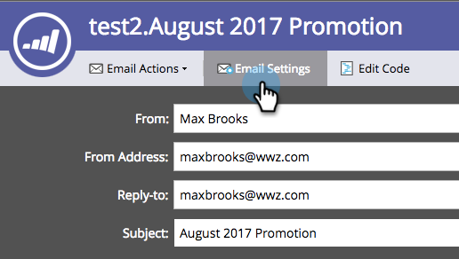

# Verkoopsjabloon vergrendelen {#lock-sales-template}

Om de gebruikers van CRM te verhinderen verkoopmalplaatjes uit te geven, kunnen de beheerders de capaciteit toelaten om malplaatjes te sluiten, die dan gebruikers toestaan om malplaatjes individueel van de e-mailredacteur te sluiten.

>[!CAUTION]
>
>Deze functie werkt alleen voor [!DNL Salesforce] en is niet compatibel met [!DNL Microsoft Dynamics] of andere CRM&#39;s. Sjablonen die via de plug-ins [!DNL Outlook] of Gmail worden geopend, worden niet vergrendeld omdat de editor niet door Marketo wordt beheerd.

## Sjabloon vergrendelen inschakelen {#enable-lock-template}

>[!NOTE]
>
>**Vereiste Bevoegdheden Admin**

1. Ga naar **[!UICONTROL Admin]** en klik vervolgens op **[!UICONTROL Sales Insight]** .

   

1. Klik onder **[!UICONTROL Settings]** op **[!UICONTROL Edit]** .

   

1. Schakel **[!UICONTROL Enable ability to lock templates]** in. Klik op **[!UICONTROL Save]**.

   

>[!NOTE]
>
>Dit selectievakje is standaard ingeschakeld en de mogelijkheid sjablonen te vergrendelen is ingeschakeld. Als u de optie uitschakelt, wordt de functie voor vergrendelingssjablonen in de e-maileditor uitgeschakeld.

>[!NOTE]
>
>Het veranderen van dit het plaatsen als admin zal **niet** met terugwerkende kracht bestaande malplaatjes beïnvloeden; d.w.z., zal het hen niet automatisch sluiten.

## Sjabloon vergrendelen in de e-maileditor {#lock-template-in-the-email-editor}

1. Selecteer het e-mailbericht dat u wilt vergrendelen en klik op **[!UICONTROL Edit Draft]** .

   

1. Klik in de e-maileditor op **[!UICONTROL Email Settings]** .

   

1. Controleer **[!UICONTROL Publish to Marketo Sales Insight]** als het nog niet is gecontroleerd. U kunt nu **[!UICONTROL Allow CRM user to edit email]** uitschakelen om de sjabloon te vergrendelen. Klik op **[!UICONTROL Save]**.

   

   >[!NOTE]
   >
   >Dit selectievakje is standaard ingeschakeld en CRM-gebruikers mogen e-mailberichten bewerken.
