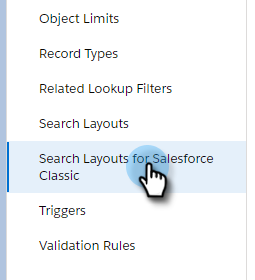

# Bulkhandelingen in Salesforce Lightning {#bulk-actions-in-salesforce-lightning}

Hier is hoe u bulkacties kunt instellen in Salesforce Lightning.

1. Klik in Salesforce op het pictogram Setup en selecteer **Setup**.

   

1. Klik op het tabblad **Objectbeheer**.

   

1. Zoek en selecteer het label **Lead**.

   

1. Klik **Schermindelingen zoeken voor Salesforce Classic**.

   

   Zoek de lay-out Lijstweergave. Klik op de vervolgkeuzelijst rechts en selecteer **Bewerken**.

   

1. Zoek en selecteer onder Aangepaste knoppen **Toevoegen aan Marketo-campagne (bliksemschicht)** en **Marketo-e-mail verzenden (bliksemschicht)**. Klik op de knop **Toevoegen**.

   

1. Klik **Opslaan**.

   

   U kunt nu bulksgewijze actieknoppen weergeven in de weergave Lijst met leads.

   >[!NOTE]
   >
   >Herhaal dezelfde stappen om acties voor grote hoeveelheden toe te voegen in de lijstweergave van uw contactpersoon.
