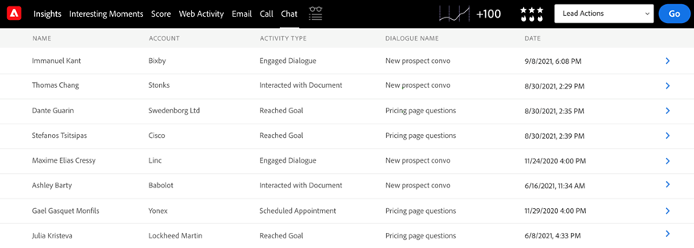

# Dynamic Chat-integratie {#dynamic-chat-integration}

Meer weten over de Dynamic Chat-integratie met Sales Insight?

>[!PREREQUISITES]
>
>* Uw pakket van Insight SFDC van de Verkoop moet versie [&#x200B; 2.4.0 of hoger zijn &#x200B;](/help/marketo/product-docs/marketo-sales-insight/msi-for-salesforce/upgrading/upgrading-your-msi-package.md){target="_blank"}
>
>* U moet de [&#x200B; integratie van Dynamic Chat &#x200B;](/help/marketo/product-docs/demand-generation/dynamic-chat/dynamic-chat-overview.md){target="_blank"} opstelling hebben
>
>* Zorg ervoor in uw Verkoop Insight [&#x200B; Operationele Montages &#x200B;](/help/marketo/product-docs/marketo-sales-insight/msi-for-salesforce/configuration/marketo-sales-insight-configuration-tab-in-salesforce.md#operational-settings){target="_blank"}, hebt u het &quot;Geheime Toegelaten Sleutel van API&quot;gebied. Als u niet, leer hoe te om het [&#x200B; hier &#x200B;](/help/marketo/product-docs/marketo-sales-insight/msi-for-salesforce/configuration/configure-marketo-sales-insight-in-salesforce-enterprise-unlimited.md#configure-sales-insight-in-marketo){target="_blank"} terug te winnen.

## [!DNL Marketo Sales Insight] Tabblad Configuratie {#marketo-sales-insight-configuration-tab}

Voer de onderstaande stappen uit om de [!DNL Dynamic Chat] -integratie in te schakelen.

1. Meld u aan bij uw [!DNL Salesforce] -account, klik op + aan het einde van de tabbalk en klik op **[!DNL Marketo Sales Insight Config]** .

1. Klik om &quot;[!UICONTROL Visualforce Panel]&quot;ongedaan te maken.

   

1. Schakel het selectievakje **[!UICONTROL Enable Dynamic Chat Data]** in.

   

## Overzicht van functies {#feature-overview}

De volgende [!DNL Dynamic Chat] -activiteiten kunnen worden benut door [!DNL Sales Insight] -gebruikers...

Dialoogvenster Ingesloten: Wordt geregistreerd in Marketo en gevuld in [!DNL Sales Insight] wanneer een bezoeker op een chatbot klikt en het dialoogvenster opent.

* Dialoognaam
* Pagina-URL
* Status (geïnitieerd/verwijderd/voltooid)

Geplande afspraak: aangemeld in Marketo en ingevuld in [!DNL Sales Insight] wanneer een bezoeker een afspraak heeft gepland via het chatbot.

* Dialoognaam
* Agent
* Pagina-URL
* Gepland op (datum- en tijdstempel invoegen)
* Status (Gepland, Opnieuw gechedeld, Geannuleerd)

Doelstelling bereikt: Wordt aangemeld in Marketo en wordt ingevuld in [!DNL Sales Insight] wanneer een bezoeker een doel bereikt in een willekeurige dialoogstroom.

* Dialoognaam
* Doelnaam
* Pagina-URL

Interactief met document: Wordt geregistreerd in Marketo en wordt ingevuld in [!DNL Sales Insight] wanneer een bezoeker communiceert met een document dat via het chatbot wordt gedeeld.

* Dialoognaam
* Document
* Status

De activiteiten van het Praatje zijn beschikbaar in het Dashboard van Inzichten.

Het tabblad Chat is beschikbaar in de deelvensters Lood en Contactpersoon. Deze bevat [!UICONTROL Activity Type] -, [!UICONTROL Dialogue Name] - en [!UICONTROL Date] -kolommen.

U kunt meer over een type activiteit leren door op het te klikken.

Op dezelfde manier bevatten de deelvensters Account en Opportunity de kolommen [!UICONTROL Name] , [!UICONTROL Activity Type] , [!UICONTROL Dialogue Name] en [!UICONTROL Date] .

Het tabblad Chatten vindt u ook op het tabblad Global Marketo. Deze omvat drie activiteitstypen ([!UICONTROL Engaged Dialogue], [!UICONTROL Scheduled Appointment], [!UICONTROL Reached Goal]), samen met de volgende kolommen:

* [!UICONTROL Person]
* [!UICONTROL Account]
* [!UICONTROL Activity type] ([!UICONTROL Engaged Dialogue] , [!UICONTROL Scheduled Appointment] , [!UICONTROL Reached Goal])
* [!UICONTROL Dialogue Name]
* [!UICONTROL Date]

U kunt meer informatie over een type activiteit krijgen door erop te klikken.

>[!NOTE]
>
>Als het selectievakje &quot;[!UICONTROL Enable Dynamic Chat data]&quot; is uitgeschakeld, worden de volgende functies uitgeschakeld:
>
>* Rij met chatactiviteiten op het dashboard Inzichten (weergave van slimme rasters en wekelijkse lijsten)
>* Tabblad Chatten in de deelvensters Lead, Contact, Account en Opportunity
>* Het tabblad Chatten op het tabblad Global Marketo
>
>Het is niet mogelijk om slechts één van deze eigenschappen onbruikbaar te maken.
