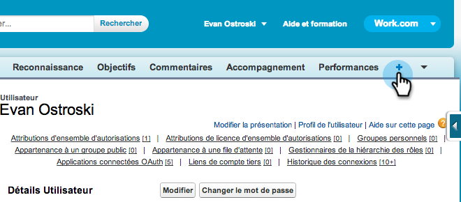

# Verkoopoverzicht voorbereiden voor meertalige ondersteuning in Salesforce {#prepare-sales-insight-for-multi-lingual-support-in-salesforce}

>[!NOTE]
>
>**Beheerdersmachtigingen vereist**

Marketo Sales Insight wordt per taal opgeslagen. Dus als u wilt dat het voor meer dan één taal werkt, moet u de referenties voor elke taal afzonderlijk invoeren.

>[!NOTE]
>
>Verkoopoverzicht biedt momenteel ondersteuning voor:
>
>* Engels
>* Frans
>* Duits

>
>
Elke andere taal wordt standaard ingesteld op Engels.

## Een nieuwe taal voor Marktverkoop toevoegen {#adding-a-new-language-for-marketo-sales-insight}

1. Meld u aan bij Salesforce. Klik in de vervolgkeuzelijst onder uw naam in de rechterbovenhoek op **Setup**.

   

1. Onder **Mijn Persoonlijke Informatie**, klik **Persoonlijke Informatie**.

   

1. Klik **Bewerken**.

   

1. Selecteer een taal en klik op **Opslaan**.

   

1. Uw Salesforce-interface bevindt zich nu in de geselecteerde taal. U kunt op het pictogram **+** klikken om alle beschikbare tabbladen weer te geven.

   

1. Klik **Het Inzicht van de Verkoop van de Marketo vormen** (in de geselecteerde taal).

   

1. Ga naar Marketo. Zoek uw [Marketo Sales Insight **API-configuratie** details](/help/marketo/product-docs/marketo-sales-insight/msi-for-salesforce/configuration/configure-marketo-sales-insight-in-salesforce-enterprise-unlimited.md#configure-marketo-sales-insight).

   

1. Voer de API-gegevens in van Marketo en klik op **Opslaan**.

   

## Salesforce terugzetten naar Engels {#change-salesforce-back-to-english}

Wanneer u klaar bent met het aanpassen van uw organisatie Salesforce, is hier hoe te om uw persoonlijke configuratie aan het Engels terug te keren.

>[!NOTE]
>
>De volgende screenshots zijn in het Frans met instructies in het Engels.  U ziet dezelfde schermen met tekst in de taal die u in de vorige stap hebt geselecteerd.

1. Klik onder uw naam op **Setup**.

1. Klik **Persoonlijke Informatie** onder **Mijn Persoonlijke Informatie**.

   

1. Klik **Bewerken**.

   

1. Selecteer **Engels** in de keuzelijst Taal en klik op **Opslaan**.

   

   Nu is je Salesforce weer in het Engels!
