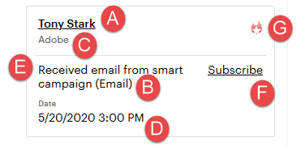

# De Lead Feed gebruiken {#using-the-lead-feed}

De Lead Feed is een actuele lijst met interessante gebeurtenissen die door uw leads worden uitgevoerd. U vindt het op de rechterkant wanneer u op het tabblad Marketo klikt. Het is als een RSS- of [!DNL Twitter] -feed - de meest recente updates staan boven aan de lijst. Gebruik dit om naar voorsprong te springen terwijl je nog vers in hun hoofd bent.

>[!NOTE]
>
>De hoofdfeed bevat zowel de leads die u hebt als de leads in uw lijst met gecontroleerde mappen.

## Wat zit er in de Loodfeed? {#whats-in-the-lead-feed}

Elk item in de hoofdfeed is een interessant moment - een opmerkelijke activiteit of gebeurtenis in de marketinggeschiedenis van deze lead.

Wanneer u deze weergeeft in [!DNL Salesforce] , heeft elk item de volgende opties:

<table>
 <colgroup>
  <col>
  <col>
 </colgroup>
 <tbody>
  <tr>
   <td>
Item
</td>
   <td>
Beschrijving
</td>
  </tr>
  <tr>
   <td>
A. Leider/contactpersoon
</td>
   <td>
Persoon die dit interessante moment had
</td>
  </tr>
  <tr>
   <td>
B. Gebeurtenistype
</td>
   <td>
Categorie voor dit moment — web, e-mail of mijlpaal
</td>
  </tr>
  <tr>
   <td>
C. Accountnaam
</td>
   <td>
Bedrijfsnaam
</td>
  </tr>
  <tr>
   <td>
D. Tijd
</td>
   <td>
Wanneer dit interessante moment optrad
</td>
  </tr>
  <tr>
   <td>
E. Beschrijving van gebeurtenis
</td>
   <td>
Reden voor dit interessante moment
</td>
  </tr>
  <tr>
   <td>
F. Abonneren
</td>
   <td>
E-mailmelding ontvangen voor gebeurtenissen als deze
</td>
  </tr>
  <tr>
   <td>
G. Star
</td>
   <td>
Deze persoon is een Best Bet (hoge prioriteit)
</td>
  </tr>
 </tbody>
</table>

## RSS-updates ophalen {#getting-rss-updates}

U kunt ook updates voor Diervoeders voor leads ophalen via RSS-feed.  Met een RSS-feed kunt u updates op uw leads ontvangen, zelfs als u niet bent verbonden met [!DNL Salesforce] . De feed heeft dezelfde informatie als de feed Lead in [!DNL Salesforce] en de volgende informatie (indien beschikbaar):

* mailadres
* telefoonnummer
* mobiel nummer
* faxnummer
* bedrijfsadres
* bedrijfs-URL

>[!NOTE]
>
>De beheerder van Marketo van uw bedrijf moet [ het voer van RSS ](/help/marketo/product-docs/marketo-sales-insight/msi-for-salesforce/features/msi-configuration-tab/enable-rss-for-sales-insight.md) voor dit toelaten om te werken.

Voor RSS-updates hebt u twee dingen nodig: de RSS-koppeling en een RSS-voederlezer. U kunt de RSS-koppeling ophalen door op het RSS-pictogram in de lead feed te klikken:

De RSS-feed wordt in een nieuw venster weergegeven. Vervolgens kunt u de URL voor de RSS-feed kopiëren en in een RSS-lezer gebruiken. De meeste browsers hebben een ingebouwde RSS-lezer, of u kunt een RSS-lezer gebruiken die specifiek is voor uw platform.
