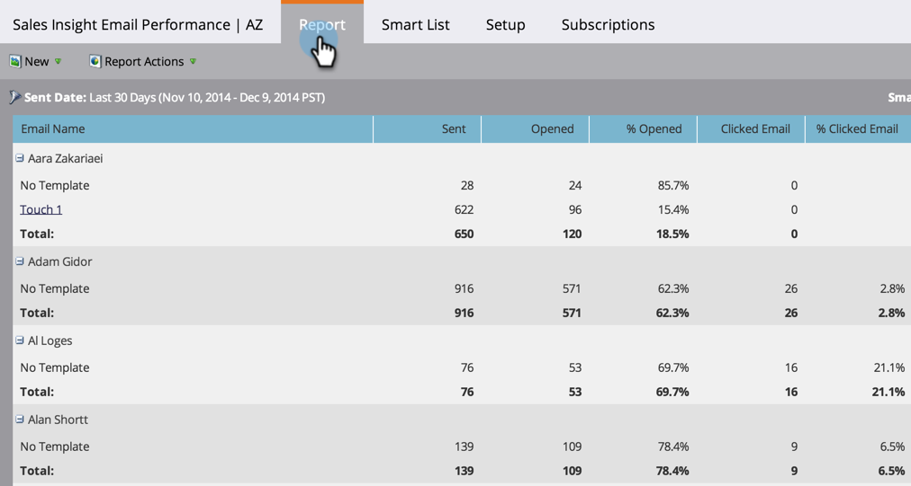

# Insight E-mailprestatierapport voor verkoop {#sales-insight-email-performance-report}

Geef de prestaties weer van e-mailberichten die via [!DNL Salesforce] , [!DNL Microsoft Dynamics] of een Gmail- of [!DNL Outlook] plug-in worden verzonden.

## Een rapport genereren {#generate-a-report}

1. Klik op **[!UICONTROL Analytics]**.

   

1. Klik op **[!UICONTROL Sales Insight Email Performance]**.

   

1. Klik op de tab **[!UICONTROL Setup]** en kies de gewenste waarden.

   

1. Klik op de tab **[!UICONTROL Report]** .

   

   Geweldig! Nu kun je zien hoe je e-mails die je van je verkoopteam hebt verzonden, zijn uitgevoerd.

   >[!NOTE]
   >
   >De geleverde status wordt niet vastgelegd voor e-mails die via Sales Insight worden verzonden en wordt niet opgenomen in dit rapport of in de activiteitenlogboeken.

>[!TIP]
>
>Klik op de naam van een e-mailbericht om het te openen in de e-mailvoorvertoning.

## Groeperen op [!UICONTROL Sales Rep] {#group-by-sales-rep}

Je kunt dit rapport gegroepeerd op Verkoopvertegenwoordiger bekijken door je instellingen te wijzigen.

1. Klik op **[!UICONTROL Setup]**. Dubbelklik op **[!UICONTROL Email]** .

   

1. Selecteer E-mails groeperen op **[!UICONTROL Sales Rep]** .

   

1. Klik op **[!UICONTROL Save]**.

   

1. Klik op de tab **[!UICONTROL Report]** .

   

   Mooi cool, hè? Je ziet nu de prestaties van e-mails gegroepeerd op verkoper.
