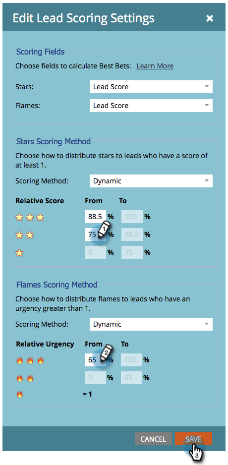

# Sterren en vlammen aanpassen {#customize-stars-and-flames}

In [!DNL Marketo Sales Insight] worden sterren en vlammen gebruikt om aan leads de prioriteit toe te kennen. Marketo bepaalt automatisch wie 1-2-3 sterren/vlammen krijgt. U kunt de formule echter wijzigen. Hieronder wordt beschreven hoe:

>[!AVAILABILITY]
>
>Niet alle Marketo Engage-gebruikers hebben deze functionaliteit aangeschaft. Neem contact op met het Adobe-accountteam (uw accountmanager) voor meer informatie.

>[!NOTE]
>
>**Vereiste Bevoegdheden Admin**

1. Klik onder [!UICONTROL Admin] op **[!UICONTROL Sales Insight]** .

1. Klik onder de sectie **[!UICONTROL Lead Scoring Settings]** op **[!UICONTROL Edit]** .

   

1. Selecteer de **[!UICONTROL Scoring Method]** van uw keuze.

   >[!NOTE]
   >
   >**Definitie**
   >
   >**[!UICONTROL Dynamic]** - is een percentagewaarde die uit [ relatieve gegevens ](/help/marketo/product-docs/marketo-sales-insight/msi-for-salesforce/features/stars-and-flames/priority-urgency-relative-score-and-best-bets.md) wordt afgeleid. Geweldige dingen. Deze methode wordt aanbevolen.
   >
   >**[!UICONTROL Static]** - Hiermee kunt u exacte muzieknummers definiëren - geen percentages meer, geen geheime sauzen meer.

   

1. Bewerk de percentagehaakjes naar wens en **[!UICONTROL Save]** .

   >[!TIP]
   >
   >Bewerk het beginpercentage. Marketo berekent het eindpercentage voor je.

   

>[!NOTE]
>
>Als er eenmaal wijzigingen zijn aangebracht, duurt het enige tijd voordat de sterren en vlammen opnieuw worden berekend. Patientie is een deugd.

Eet! U hebt net de manier aangepast waarop Marketo sterren en vlammen berekent om beter aan uw bedrijfsbehoeften te voldoen.
