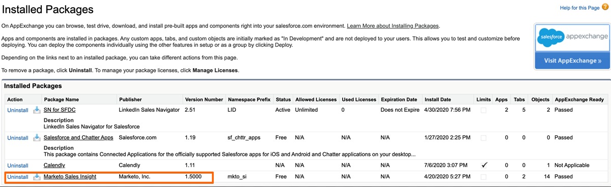

# [!DNL Marketo Sales Insight] Pakket installeren in [!DNL Salesforce] AppExchange {#install-marketo-sales-insight-package-in-salesforce-appexchange}

U moet de app [!DNL Marketo Sales Insight] installeren in uw [!DNL Salesforce] -abonnement voordat u kunt genieten van alle goedheid die [!DNL Sales Insight] biedt. Zo gaat het.

>[!NOTE]
>
>**Vereiste Bevoegdheden Admin**

>[!NOTE]
>
>[!DNL Marketo Sales Insight] is compatibel met [!DNL Salesforce] Platform (Shield) Encryption.

1. Ga naar de [ pagina van AppExchange voor  [!DNL Marketo Sales Insight] ](https://appexchange.salesforce.com/listingDetail?listingId=a0N30000001SVZmEAO) en klik **[!UICONTROL Get it Now]**.

   

1. Klik op **[!UICONTROL Log in to the AppExchange]** en meld u aan met uw [!DNL Salesforce] -referenties.

1. Voer de aanmelding van uw verbonden [!DNL Salesforce] -account in en klik op **[!UICONTROL Install in Production]** .

   

   >[!TIP]
   >
   >Kies **[!UICONTROL Install in Sandbox]** als u deze eerst in uw sandbox wilt uittesten.

1. Lees en accepteer de voorwaarden en bepalingen en klik vervolgens op **[!UICONTROL Confirm and Install]** .

   

1. U kunt aan &quot;[!UICONTROL Install for Admins Only]&quot;kiezen (en MSI toegang tot specifieke profielen later), &quot;[!UICONTROL Install for All Users],&quot;of, &quot;[!UICONTROL Install for Specific Profiles] verlenen.&quot;

   

1. Het volgende bericht wordt mogelijk weergegeven wanneer u het installatieproces start. U ontvangt een e-mail zodra de installatie is voltooid. Klik **Gedaan** om te sluiten.

   

1. Controleer of **[!UICONTROL Marketo Sales Insight]** zich in de geïnstalleerde pakketten bevindt.

   

1. Klik op **[!UICONTROL Setup]** naast uw naam.

   

1. Zoek naar &quot;[!UICONTROL objects]&quot; en klik vervolgens op **[!UICONTROL Objects]** onder **[!UICONTROL Create]** .

   

1. Controleer of **[!UICONTROL Deployed]** is gecontroleerd op alle [!DNL Marketo Sales Insight] -items.

   

1. Als een object niet wordt geïmplementeerd, klikt u op **[!UICONTROL Edit]** naast het item.

   

1. Selecteer **[!UICONTROL Deployment Status]** onder **[!UICONTROL Deployed]** en klik op **[!UICONTROL Save]** .

   

Geweldig werk! Nu hebt u [!DNL Marketo Sales Insight] geïnstalleerd en geïmplementeerd. Ga vooruit en vorm het voor uw verkoopteam en bekijk de verkoopskyrocket.

>[!MORELIKETHIS]
>
>* [ vorm  [!DNL Marketo Sales Insight]  in  [!DNL Salesforce]  Professionele Uitgave ](/help/marketo/product-docs/marketo-sales-insight/msi-for-salesforce/configuration/configure-marketo-sales-insight-in-salesforce-professional-edition.md)
>* [ vorm  [!DNL Marketo Sales Insight]  in  [!DNL Salesforce]  Onderneming/Onbeperkt ](/help/marketo/product-docs/marketo-sales-insight/msi-for-salesforce/configuration/configure-marketo-sales-insight-in-salesforce-enterprise-unlimited.md)
>* [ voeg de Toegang van Insight van de Verkoop aan Profielen toe ](/help/marketo/product-docs/marketo-sales-insight/msi-for-salesforce/configuration/add-sales-insight-access-to-profiles.md){target="_blank"}
