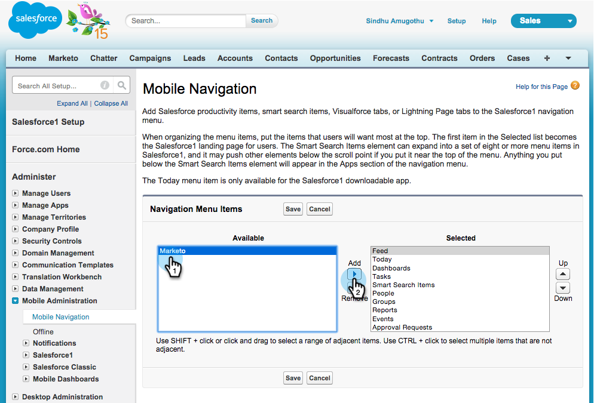
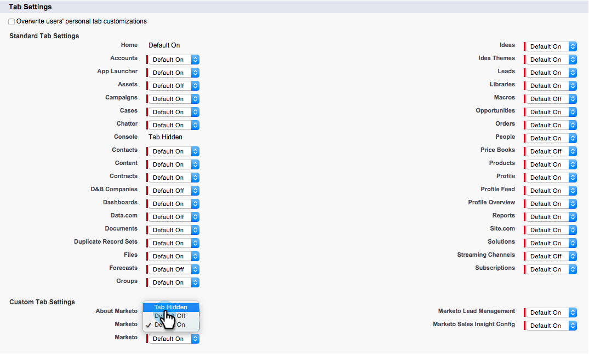
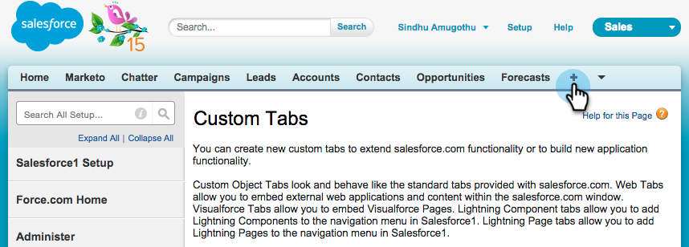

# Installeren en configureren [!DNL Marketo Sales Insight] in [!DNL Salesforce1] {#install-and-configure-marketo-sales-insight-in-salesforce}

>[!NOTE]
>
>Bestaande klanten, gelieve [ Uw Pakket MSI ](/help/marketo/product-docs/marketo-sales-insight/msi-for-salesforce/upgrading/upgrading-your-msi-package.md) te bevorderen alvorens u verdergaat!

>[!PREREQUISITES]
>
>Als u Salesforce Enterprise/Unlimited hebt:
>
>* [ Stap 1 van 3: Voeg de Gebieden van Marketo aan  [!DNL Salesforce]  toe (Onderneming/Onbeperkt) ](/help/marketo/product-docs/crm-sync/salesforce-sync/setup/enterprise-unlimited-edition/step-1-of-3-add-marketo-fields-to-salesforce-enterprise-unlimited.md)
>* [ Stap 2 van 3: Creeer a [!DNL Salesforce]  Gebruiker voor Marketo (Onderneming/Onbeperkt) ](/help/marketo/product-docs/crm-sync/salesforce-sync/setup/enterprise-unlimited-edition/step-2-of-3-create-a-salesforce-user-for-marketo-enterprise-unlimited.md)
>* [ Stap 3 van 3: Verbind Marketo en  [!DNL Salesforce]  (Onderneming/Onbeperkt) ](/help/marketo/product-docs/crm-sync/salesforce-sync/setup/enterprise-unlimited-edition/step-3-of-3-connect-marketo-and-salesforce-enterprise-unlimited.md)
>* [ vorm  [!DNL Marketo Sales Insight]  in  [!DNL Salesforce]  Onderneming/Onbeperkt ](/help/marketo/product-docs/marketo-sales-insight/msi-for-salesforce/configuration/configure-marketo-sales-insight-in-salesforce-enterprise-unlimited.md)
>
>Als u Salesforce Professional hebt:
>
>* [ vorm Marketo Verkoop Insight in de Professionele Uitgave van Salesforce ](/help/marketo/product-docs/marketo-sales-insight/msi-for-salesforce/configuration/configure-marketo-sales-insight-in-salesforce-professional-edition.md)
>

>[!NOTE]
>
>[!DNL Marketo Sales Insight] in [!DNL Salesforce1] omvat: [!DNL B test Bets &#x200B;], voer van het Lood, het Interesten Momenten, en voeg aan de Campagne van Marketo toe.

## De mobiele toepassing van [!DNL Salesforce1] inschakelen {#enable-the-salesforce1-mobile-app}

1. Klik op **[!DNL Setup]** en vervolgens op **[!DNL Mobile Administration]**.

   

1. Klik op **[!UICONTROL Salesforce1]**.

   

1. Klik op **[!UICONTROL Salesforce1 Settings]**.

   

1. Klik op **[!UICONTROL Enable the Salesforce1 mobile browser app]**.

   

1. Klik op **[!UICONTROL Save]**.

   

1. Selecteer **[!UICONTROL Mobile Administration]** .

   

1. Klik op **[!UICONTROL Manage the mobile navigation menu]**.

   

1. Selecteer **[!UICONTROL Marketo]** en **[!UICONTROL Add]** het aan de **[!UICONTROL Selected]** menu-items.

   

1. Selecteer **[!UICONTROL Marketo]** , verplaats het **[!UICONTROL Up]** naar een gewenst gebied en klik op **[!UICONTROL Save]** .

   

## Verouderd aangepast Marketo-object verbergen {#hide-outdated-marketo-custom-object}

1. Klik op **[!UICONTROL Setup]**.

   

1. Selecteer **[!UICONTROL Manage Users]** .

   

1. Selecteer **[!UICONTROL Profiles]** .

   

1. Klik om de gewenste profielen **[!UICONTROL Edit]** te selecteren.

   

1. Onder **[!UICONTROL Tab Settings]**, selecteer _eerst_ **[!UICONTROL Marketo]**.

   

1. Selecteer **[!UICONTROL Tab Hidden]** .

   

   >[!NOTE]
   >
   >Verberg het tabblad Marketo voor alle gewenste profielen.

## Tabs aanpassen {#customize-tabs}

1. Klik **+**.

   

1. Klik op **[!UICONTROL Customize My Tabs]**.

   

1. Selecteer **[!UICONTROL Marketo]** en **[!UICONTROL Add]** het aan de Geselecteerde Lusjes.

   

1. Selecteer **[!UICONTROL Marketo]** , verplaats het **[!UICONTROL Up]** naar een gewenst gebied en klik op **[!UICONTROL Save]** .

   

## Paginalay-outs aanpassen {#customize-page-layouts}

1. Klik op **[!UICONTROL Setup]**.

   

1. Klik op **[!UICONTROL Setup]** , typ **[!UICONTROL Page Layouts]** en klik op **[!UICONTROL Page Layouts]** onder Leads.

   >[!NOTE]
   >
   >Herhaal de stappen voor elke pagina-indeling die uw organisatie gebruikt (marketing, verkoop, enz.) voor de objecten Contact, Account en Opportunity.

   

1. Klik op **[!UICONTROL Edit]** om wijzigingen aan te brengen in de layout van de lead.

   

1. Klik op **[!UICONTROL Visualforce Pages]** en sleep **[!UICONTROL Lead Mobile]** naar de sectie Mobiele kaarten.

   

1. Wijzig de hoogte in 66 en klik op **[!UICONTROL OK]** .

   

1. Klik op **[!UICONTROL Fields]** en sleep **[!UICONTROL Add to Marketo Campaign]** naar de sectie **[!UICONTROL Marketo Sales Insight]** .

   

   >[!TIP]
   >
   >Typ &quot;Toevoegen aan&quot; in de snelzoekopdracht om Toevoegen aan Marketo-campagne gemakkelijk te vinden.

1. Klik op **[!UICONTROL Save]**.

   

Phew! U bent klaar met de installatie van [!DNL Marketo Sales Insight] for [!DNL Salesforce1]! Ga je gang en geef jezelf een stukje op de rug.

>[!MORELIKETHIS]
>
>* [[!DNL Best Bets]  in  [!DNL Salesforce1]](/help/marketo/product-docs/marketo-sales-insight/msi-for-salesforce/msi-for-mobile/best-bets-in-salesforce1.md)
>* [ Interesserende Momenten in  [!DNL Salesforce1]](/help/marketo/product-docs/marketo-sales-insight/msi-for-salesforce/msi-for-mobile/interesting-moments-in-salesforce1.md)
>* [ verzend Marketo E-mail en Campagne en de Acties van de Controlelijst in  [!DNL Salesforce1]](/help/marketo/product-docs/marketo-sales-insight/msi-for-salesforce/msi-for-mobile/send-marketo-email-and-campaign-and-watchlist-actions-in-salesforce1.md)
