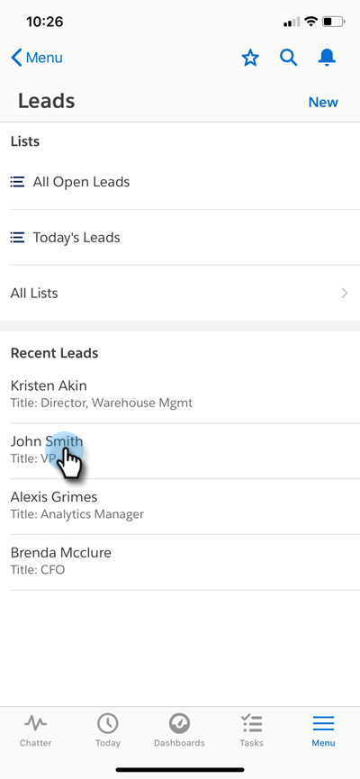

# Interesserende momenten in [!DNL Salesforce1] {#interesting-moments-in-salesforce}

[&#x200B; het Gebruiken van Interesserende Momenten &#x200B;](/help/marketo/product-docs/marketo-sales-insight/msi-for-salesforce/features/tabs-in-the-msi-panel/interesting-moments/using-interesting-moments.md) is de sleutel aan het communiceren met uw verkoopteam door de Insight app van de Verkoop van Marketo. Met [!DNL Marketo Sales Insight] for [!DNL Salesforce1] kunt u nu hetzelfde doen met uw smartphone!

>[!AVAILABILITY]
>
>Deze zijn alleen beschikbaar voor [!DNL Marketo Sales Insight] -klanten.

1. Open de app [!DNL Salesforce] op uw smartphone.

1. Navigeer naar een lead.

   

1. Klik op het tabblad **[!UICONTROL Related]** om Interesserende momenten, Webactiviteit, E-mail en Score weer te geven.

   

>[!MORELIKETHIS]
>
>* [&#x200B; Interessant Moment &#x200B;](/help/marketo/product-docs/core-marketo-concepts/smart-campaigns/flow-actions/interesting-moment.md)
>* [&#x200B; Tokens voor het Interesten Momenten &#x200B;](/help/marketo/product-docs/marketo-sales-insight/msi-for-salesforce/features/tabs-in-the-msi-panel/interesting-moments/trigger-tokens-for-interesting-moments.md)
