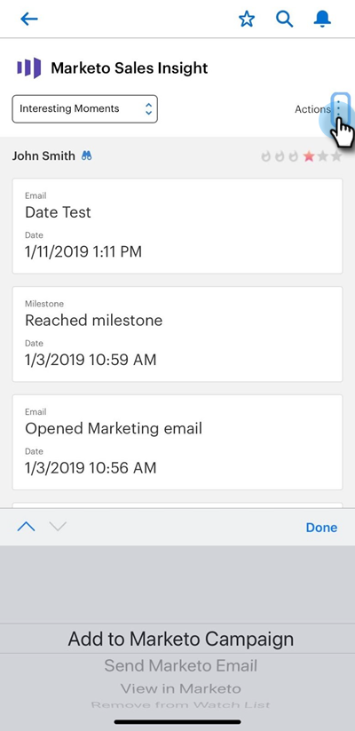

# Handelingen voor Marketo-e-mail, -campagne en -controlelijst verzenden in [!DNL Salesforce1] {#send-marketo-email-and-campaign-and-watchlist-actions-in-salesforce}

1. Ga naar het gebied Details lead in [!DNL Salesforce1] en klik op de tab **[!UICONTROL Related]** .

   

1. Klik op de gegevens (drie kleine stippen). Bij de bodem kunt u van kiezen: &quot;[!UICONTROL Add to Marketo Campaign]&quot;, &quot;[!UICONTROL Send Marketo Email],&quot; [!UICONTROL View in Marketo],&quot;&quot;[!UICONTROL Add from Watchlist],&quot;&quot;[!UICONTROL Remove from Watchlist].&quot;

   

   >[!NOTE]
   >
   >Welke slimme campagnes verschijnen? De triggers met &quot;Campagne is aangevraagd&quot;. Leer hoe te opstelling a [&#x200B; getriggerde campagne gebruikend &quot;Campagne wordt Gevraagd &#x200B;](/help/marketo/product-docs/core-marketo-concepts/smart-campaigns/flow-actions/request-campaign.md)&quot;.

Koel, nu kunnen je verkopers actief deelnemen aan de marketingactiviteiten.

>[!NOTE]
>
>**Voorbeeld**
>
>Goede slimme campagnes om aan te vragen zouden als kunnen klinken:
>
>1. Langdurige zorg - als ze dit jaar geen budget hebben
>1. Actieve verkoopcyclus - wanneer de verkoper geen berichten aan het lood behalve hun wil (gebruik de marketing geschorste vlag om hen tijdelijk op te zeggen)
>
>Wees creatief. Wat wil de verkoper automatiseren? Vraag het hen gewoon en doe het op!
