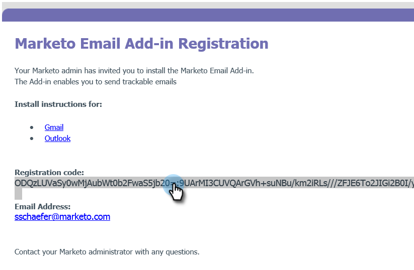

# De Marketo E-mailinvoegtoepassing voor [!DNL Outlook] installeren met een registratiecode {#install-the-marketo-email-add-in-for-outlook-with-a-registration-code}

Als gebruikers toegang hebben tot de beheerinstellingen op hun laptops, kunt u een registratiecode rechtstreeks naar hen sturen.

Als u geen uitnodigings-e-mail hebt ontvangen, vraagt u de Marketo-beheerder om u uit te nodigen.

>[!PREREQUISITES]
>
>U moet [ worden uitgegeven een Vergunning van de Vergunning van de E-mail van Marketo toe:voegen-binnen ](/help/marketo/product-docs/marketo-sales-insight/msi-outlook-plugin/issue-a-marketo-email-add-in-license.md).

>[!IMPORTANT]
>
>Installatie wordt niet ondersteund op pc&#39;s waarin de map Windows User tekens bevat die niet uit het Engels bestaan. Deze map wordt automatisch door Windows onder `<System Root>\Users\` gegenereerd op basis van de Windows-gebruikersnaam en kan niet-Engelse tekens bevatten als de Windows-gebruikersnaam een niet-Engelse naam is. Werk samen met uw IT-team om te controleren of er installatiekwesties optreden.

>[!NOTE]
>
>De mogelijkheden van Handelingen van Insight van de verkoop, met inbegrip van Verkoop E-mail verzenden, toevoegen aan de Campagne van de Verkoop, en Taken, zijn niet beschikbaar in de de e-mailplug-ins van de Verkoop Insight voor Gmail en Vooruitzichten. Op dit moment kunnen gebruikers alleen een e-mailbericht met of zonder Marketo-sjabloon van hun e-mailclient verzenden als ze de e-mailplug-ins voor Insight kopen gebruiken.

## Installatieprogramma downloaden {#download-installer}

1. Identificeer uw [ versie van de Vooruitzichten van Microsoft ](https://support.office.com/en-us/article/what-version-of-outlook-do-i-have-b3a9568c-edb5-42b9-9825-d48d82b2257c){target="_blank"}.

1. Klik in de onderstaande tabel op de koppeling om het juiste ZIP-bestand voor uw versie van Microsoft Outlook te downloaden.

1. Pak het bestand uit om het benodigde MSI-bestand te openen en ga verder met de installatie.

   >[!NOTE]
   >
   >Op dit moment werken de onderstaande koppelingen alleen in [!DNL Microsoft Edge] of door met de rechtermuisknop te klikken in [!DNL Chrome] . Sorry voor enig ongemak.

<table><thead>
  <tr>
    <th>Outlook-versie</th>
    <th>32-bits Outlook</th>
    <th>64-bits Outlook</th>
  </tr></thead>
<tbody>
  <tr>
    <td>Outlook 2000</td>
    <td>Niet ondersteund</td>
    <td>NVT</td>
  </tr>
  <tr>
    <td>Outlook 2003</td>
    <td><a href="https://munchkin.marketo.net/MarketoAddInSetup32.zip">Downloaden</a></td>
    <td>NVT</td>
  </tr>
  <tr>
    <td>Outlook 2007</td>
    <td><a href="https://munchkin.marketo.net/MarketoAddInSetup32.zip">Downloaden</a></td>
    <td>NVT</td>
  </tr>
  <tr>
    <td>Outlook 2010</td>
    <td><a href="https://munchkin.marketo.net/MarketoAddInSetup32.zip">Downloaden</a></td>
    <td><a href="https://munchkin.marketo.net/MarketoAddInSetup64.zip">Downloaden</a></td>
  </tr>
  <tr>
    <td>Outlook 2013</td>
    <td><a href="https://munchkin.marketo.net/MarketoAddInSetup32.zip">Downloaden</a></td>
    <td><a href="https://munchkin.marketo.net/MarketoAddInSetup64.zip">Downloaden</a></td>
  </tr>
  <tr>
    <td>Outlook 2016</td>
    <td><a href="https://munchkin.marketo.net/MarketoAddInSetup32.zip">Downloaden</a></td>
    <td><a href="https://munchkin.marketo.net/MarketoAddInSetup64.zip">Downloaden</a></td>
  </tr>
  <tr>
    <td>Outlook 2019</td>
    <td><a href="https://munchkin.marketo.net/MarketoAddInSetup32.zip">Downloaden</a></td>
    <td><a href="https://munchkin.marketo.net/MarketoAddInSetup64.zip">Downloaden</a></td>
  </tr>
  <tr>
    <td>Outlook voor Mac</td>
    <td>Niet ondersteund</td>
    <td>Niet ondersteund</td>
  </tr>
  <tr>
    <td>Outlook Web App</td>
    <td>Niet ondersteund</td>
    <td>Niet ondersteund</td>
  </tr>
  <tr>
    <td>Office 365*</td>
    <td><a href="https://munchkin.marketo.net/MarketoAddInSetup32.zip">Downloaden</a></td>
    <td><a href="https://munchkin.marketo.net/MarketoAddInSetup64.zip">Downloaden</a></td>
  </tr>
</tbody></table>

*[!DNL Office] 365 version: [!DNL Windows] alleen client (op [!DNL Windows] 10, [!DNL Enterprise] of [!DNL Pro]).

>[!IMPORTANT]
>
>Microsoft heeft a [ nieuwe versie van Vooruitzichten voor Vensters ](https://techcommunity.microsoft.com/t5/outlook-blog/new-outlook-for-windows-now-available/ba-p/3932068){target="_blank"} vrijgegeven. Deze nieuwe versie steunt niet de bestaande stop van Vooruitzichten MSI. De insteekmodule MSI Outlook blijft werken voor Windows-desktops met de klassieke versie van Outlook. Meer over de nieuwe Vooruitzichten voor Vensters voor organisaties leren, [ klik hier ](https://techcommunity.microsoft.com/t5/outlook-blog/the-new-outlook-for-windows-for-organization-admins/ba-p/3929169){target="_blank"}.

## Je inschrijvingscode kopiëren {#copy-your-registration-code}

1. Kopieer de registratiecode van de uitnodigings-e-mail u hebt ontvangen.

   

1. Close [!DNL Microsoft Outlook].

   

## Installeren {#install}

1. Voer het installatieprogramma uit.

   

   >[!NOTE]
   >
   >Als je een beveiligingswaarschuwing krijgt, maak je dan geen zorgen! Enkel klik **Looppas**.

1. Klik op **[!UICONTROL Next]**.

   

1. Vul **[!UICONTROL First Name]**, **[!UICONTROL Last Name]**, **[!UICONTROL Email Address]** in, kopieer en plak de **[!UICONTROL Registration code]** van de e-mail naar het formulier en klik op **[!UICONTROL Next]** .

   

   >[!TIP]
   >
   >Als de installatie mislukt, raadpleegt u uw IT-afdeling om ervoor te zorgen dat HTTPS-verkeer niet wordt geblokkeerd. Het installatieprogramma vereist dat HTTPS-verkeer is geopend.

1. Klik op **[!UICONTROL Next]** om te installeren op de standaardlocatie.

   

1. Klik op **[!UICONTROL Next]**.

   

   >[!NOTE]
   >
   >Klik op **[!UICONTROL Yes]** als er een beveiligingswaarschuwing over een onbekende uitgever verschijnt.

1. De installatie is nu voltooid, klik op **[!UICONTROL Close]** .

   

1. Open nu [!DNL Microsoft Outlook] en bekijk de Marketo-knoppen.

   

   Uitstekend! De Marketo-knoppen zijn nu beter geplaatst.

Meer informatie over het gebruik van Marketo Message and Log With Marketo-handelingen.

>[!MORELIKETHIS]
>
>* [ verzend en spoor een E-mail met Marketo E-mail toe:voegen-binnen voor Vooruitzichten ](/help/marketo/product-docs/marketo-sales-insight/msi-outlook-plugin/send-and-track-an-email-with-the-email-add-in-for-outlook.md){target="_blank"}
>* [ verzend en Spoor van Vooruitzichten die een Malplaatje van Marketo gebruiken ](/help/marketo/product-docs/marketo-sales-insight/msi-outlook-plugin/send-and-track-from-outlook-using-a-marketo-template.md){target="_blank"}
