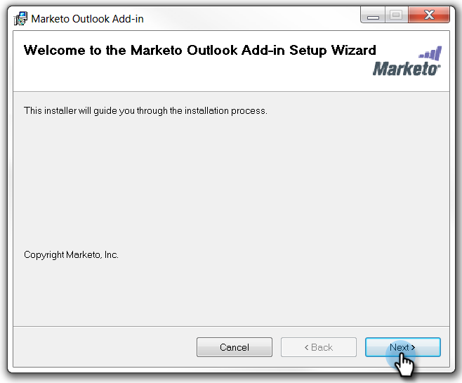
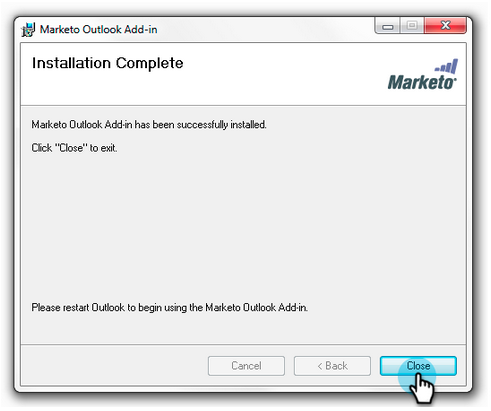

# Installeer de toe:voegen-binnen E-mail van de Marketo voor Vooruitzichten met een Code {#install-the-marketo-email-add-in-for-outlook-with-a-registration-code} van de Registratie

Als gebruikers toegang hebben tot de beheerinstellingen op hun laptops, kunt u een registratiecode rechtstreeks naar hen sturen.

Als u geen uitnodigings-e-mail hebt ontvangen, vraagt u de beheerder van Marketo om u uit te nodigen.

>[!PREREQUISITES]
>
>U moet [uitgegeven een vergunning van de Toevoeging van de Marketo E-mail ](/help/marketo/product-docs/marketo-sales-insight/msi-outlook-plugin/issue-a-marketo-email-add-in-license.md) zijn.

## Installatieprogramma {#download-installer} downloaden

1. Uw [Microsoft Outlook-versie](https://support.office.com/en-us/article/what-version-of-outlook-do-i-have-b3a9568c-edb5-42b9-9825-d48d82b2257c) identificeren

1. Klik op de koppeling om het installatieprogramma te downloaden dat geschikt is voor uw versie van Microsoft Outlook.

   >[!NOTE]
   >
   >De onderstaande koppelingen werken momenteel alleen in Chrome. Sorry voor enig ongemak.

   | Outlook-versie | 32-bits Outlook | 64-bits Outlook |
   |---|---|---|
   | Outlook 2000 | Niet ondersteund | N.v.t. |
   | Outlook 2003 | [Downloaden](https://munchkin.marketo.net/MarketoAddInSetup32.msi) | N.v.t. |
   | Outlook 2007 | [Downloaden](https://munchkin.marketo.net/MarketoAddInSetup32.msi) | N.v.t. |
   | Outlook 2010 | [Downloaden](https://munchkin.marketo.net/MarketoAddInSetup32.msi) | [Downloaden](https://munchkin.marketo.net/MarketoAddInSetup64.msi) |
   | Outlook 2013 | [Downloaden](https://munchkin.marketo.net/MarketoAddInSetup32.msi) | [Downloaden](https://munchkin.marketo.net/MarketoAddInSetup64.msi) |
   | Outlook 2016 | [Downloaden](https://munchkin.marketo.net/MarketoAddInSetup32.msi) | [Downloaden](https://munchkin.marketo.net/MarketoAddInSetup64.msi) |
   | Outlook 2019 | [Downloaden](https://munchkin.marketo.net/MarketoAddInSetup32.msi) | [Downloaden](https://munchkin.marketo.net/MarketoAddInSetup64.msi) |
   | Outlook O365 (alleen Windows) | [Downloaden](https://munchkin.marketo.net/MarketoAddInSetup32.msi) | [Downloaden](https://munchkin.marketo.net/MarketoAddInSetup64.msi) |
   | Outlook voor Mac | Niet ondersteund | Niet ondersteund |
   | Outlook Web App | Niet ondersteund | Niet ondersteund |

## Uw registratiecode kopiëren {#copy-your-registration-code}

1. Kopieer de registratiecode van de uitnodigings-e-mail u hebt ontvangen.

   

1. Sluit Microsoft Outlook.

   

## {#install} installeren

1. Voer het installatieprogramma uit.

   

   >[!NOTE]
   >
   >Als je een beveiligingswaarschuwing krijgt, maak je dan geen zorgen! Klik **Run**.

1. Klik **Volgende**.

   

1. Vul **Voornaam**, **Achternaam**, **E-mailadres** in, kopieer en plak de **Registratiecode** van de e-mail naar het formulier en klik **Volgende**.

   

   >[!TIP]
   >
   >Als de installatie mislukt, raadpleegt u uw IT-afdeling om ervoor te zorgen dat HTTPS-verkeer niet wordt geblokkeerd. Het installatieprogramma vereist dat HTTPS-verkeer is geopend.

1. Klik **Volgende** om op de standaardlocatie te installeren.

   

1. Klik **Volgende**.

   

   >[!NOTE]
   >
   >Als u een veiligheidsherinnering over een onbekende uitgever krijgt, klik **ja**.

1. De installatie is nu voltooid, klik **Close**.

   

1. Open nu Microsoft Outlook en bekijk de knoppen Marketo.

   

   Uitstekend! De markeerknoppen bevinden zich nu op een betere plaats.

Meer informatie over het gebruik van Marketo Message and Log With Marketo actions.

>[!MORELIKETHIS]
>
>* [E-mail verzenden en bijhouden met de Marketo-e-mailinvoegtoepassing voor Outlook](/help/marketo/product-docs/marketo-sales-insight/msi-outlook-plugin/send-and-track-an-email-with-the-email-add-in-for-outlook.md)
>* [Verzenden en volgen vanuit Outlook met behulp van een Marketo-sjabloon](/help/marketo/product-docs/marketo-sales-insight/msi-outlook-plugin/send-and-track-from-outlook-using-a-marketo-template.md)

