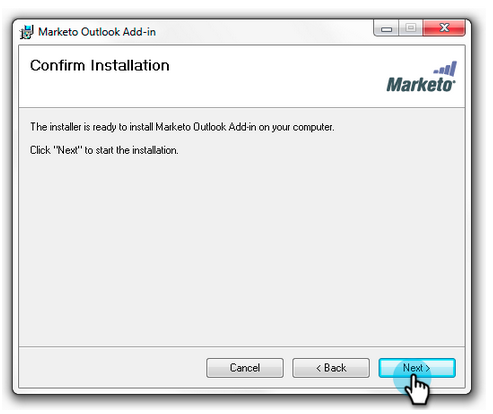
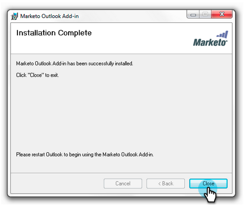

# Upgrade uw Marketo-invoegtoepassing voor e-mail voor [!DNL Outlook] {#upgrade-your-marketo-email-add-in-for-outlook}

Als er een nieuwe versie van de Marketo E-mailinvoegtoepassing voor [!DNL Outlook] beschikbaar is, volgt u deze instructies om een upgrade uit te voeren.

>[!NOTE]
>
>Vanaf 10/1/20 ondersteunt de nieuwste versie van de plug-in [!DNL Outlook] de offline modus niet meer. Dit wordt van kracht na de installatie/upgrade op of na 10/1.

## Installatieprogramma downloaden {#download-installer}

Download het installatieprogramma dat geschikt is voor uw versie van Microsoft [!DNL Outlook] .

<table>
 <colgroup>
  <col>
  <col>
  <col>
  <col>
  <col>
 </colgroup>
 <tbody>
  <tr>
   <th> </th>
   <th colspan="2">Uitnodiging voor één gebruiker installeren</th>
   <th colspan="2">Installatie van Enterprise Key</th>
  </tr>
  <tr>
   <td><strong> Versie van 0&rbrace; Vooruitzichten &lbrace;</strong></td>
   <td><strong>32-bits</strong></td>
   <td><strong>64-bits</strong></td>
   <td><strong>32-bits</strong></td>
   <td><strong>64-bits</strong></td>
  </tr>
  <tr>
   <td> Vooruitzichten  2000</td>
   <td>Niet ondersteund</td>
   <td>NVT</td>
   <td>Niet ondersteund</td>
   <td>NVT</td>
  </tr>
  <tr>
   <td>Outlook 2003</td>
   <td><a href="https://munchkin.marketo.net/MarketoAddInSetup32.msi" rel="nofollow">Downloaden</a></td>
   <td>NVT</td>
   <td>Niet ondersteund</td>
   <td>NVT</td>
  </tr>
  <tr>
   <td> Vooruitzichten  2007</td>
   <td><a href="https://munchkin.marketo.net/MarketoAddInSetup32.msi" rel="nofollow">Downloaden</a></td>
   <td>NVT</td>
   <td>Niet ondersteund</td>
   <td>NVT</td>
  </tr>
  <tr>
   <td> Vooruitzichten  2010</td>
   <td><a href="https://munchkin.marketo.net/MarketoAddInSetup32.msi" rel="nofollow">Downloaden</a></td>
   <td><a href="https://munchkin.marketo.net/MarketoAddInSetup64.msi" rel="nofollow">Downloaden</a></td>
   <td><a href="https://munchkin.marketo.net/MarketoAddInSetup32.msi" rel="nofollow">Downloaden</a></td>
   <td><a href="https://munchkin.marketo.net/MarketoAddInSetup64.msi" rel="nofollow">Downloaden</a></td>
  </tr>
  <tr>
   <td> Vooruitzichten  2013</td>
   <td><a href="https://munchkin.marketo.net/MarketoAddInSetup32.msi" rel="nofollow">Downloaden</a></td>
   <td><a href="https://munchkin.marketo.net/MarketoAddInSetup64.msi" rel="nofollow">Downloaden</a></td>
   <td><a href="https://munchkin.marketo.net/MarketoAddInSetup32.msi" rel="nofollow">Downloaden</a></td>
   <td><a href="https://munchkin.marketo.net/MarketoAddInSetup64.msi" rel="nofollow">Downloaden</a></td>
  </tr>
  <tr>
   <td> Vooruitzichten  2016</td>
   <td><a href="https://munchkin.marketo.net/MarketoAddInSetup32.msi" rel="nofollow">Downloaden</a></td>
   <td><a href="https://munchkin.marketo.net/MarketoAddInSetup64.msi" rel="nofollow">Downloaden</a></td>
   <td><a href="https://munchkin.marketo.net/MarketoAddInSetup32.msi" rel="nofollow">Downloaden</a></td>
   <td><a href="https://munchkin.marketo.net/MarketoAddInSetup64.msi" rel="nofollow">Downloaden</a></td>
  </tr>
  <tr>
   <td colspan="1"> Vooruitzichten  2019</td>
   <td colspan="1"><a href="https://munchkin.marketo.net/MarketoAddInSetup32.msi" rel="nofollow">Downloaden</a></td>
   <td colspan="1"><a href="https://munchkin.marketo.net/MarketoAddInSetup64.msi" rel="nofollow">Downloaden</a></td>
   <td colspan="1"><a href="https://munchkin.marketo.net/MarketoAddInSetup32.msi" rel="nofollow">Downloaden</a></td>
   <td colspan="1"><a href="https://munchkin.marketo.net/MarketoAddInSetup64.msi" rel="nofollow">Downloaden</a></td>
  </tr>
  <tr>
   <td> Vooruitzichten  voor Mac</td>
   <td>Niet ondersteund</td>
   <td>Niet ondersteund</td>
   <td>Niet ondersteund</td>
   <td>Niet ondersteund</td>
  </tr>
  <tr>
   <td colspan="1"> Web App van de Vooruitzichten </td>
   <td colspan="1">Niet ondersteund</td>
   <td colspan="1">Niet ondersteund</td>
   <td colspan="1">Niet ondersteund</td>
   <td colspan="1">Niet ondersteund</td>
  </tr>
  <tr>
   <td colspan="1"> Bureau  365*</td>
   <td colspan="1"><a href="https://munchkin.marketo.net/MarketoAddInSetup32.msi" rel="nofollow">Downloaden</a></td>
   <td colspan="1"><a href="https://munchkin.marketo.net/MarketoAddInSetup64.msi" rel="nofollow">Downloaden</a></td>
   <td colspan="1"><a href="https://munchkin.marketo.net/MarketoAddInSetup32.msi" rel="nofollow">Downloaden</a></td>
   <td colspan="1"><a href="https://munchkin.marketo.net/MarketoAddInSetup64.msi" rel="nofollow">Downloaden</a></td>
  </tr>
 </tbody>
</table>

&#42; Bureau 365 versie: De cliënt van vensters slechts (op Vensters 10, Vensters 11, Onderneming, of Pro).

## Upgrade {#upgrade}

1. Identificeer uw [[!DNL Microsoft Outlook]  versie ](https://support.microsoft.com/en-us/office/what-version-of-outlook-do-i-have-b3a9568c-edb5-42b9-9825-d48d82b2257c?ui=en-us&rs=en-us&ad=us).

1. Selecteer uw versie in de bovenstaande lijst.

1. Voer het installatieprogramma uit.

   

1. Klik op **[!UICONTROL Next]**.

   

   >[!NOTE]
   >
   >In bepaalde gevallen ontbreken de gegevens. Kopieer het uit de registratie-e-mail en sluit vervolgens [!DNL Outlook] .

1. Close [!DNL Microsoft Outlook].

   

1. Je ziet dat al je gegevens zijn voorgevuld. Klik gewoon op **[!UICONTROL Next]** .

   

   >[!TIP]
   >
   >Als de installatie mislukt, werkt u samen met uw IT-afdeling om ervoor te zorgen dat HTTPS-verkeer niet wordt geblokkeerd. Het installatieprogramma vereist dat HTTPS-verkeer is geopend.

1. Klik op **[!UICONTROL Next]** om te installeren op de standaardlocatie.

   

1. Klik op **[!UICONTROL Next]**.

   

1. De installatie is nu voltooid. Klik op **[!UICONTROL Close]**.

   

1. Open [!UICONTROL Microsoft Outlook] nu om de nieuwste versie van de Marketo-knoppen te bekijken.

   

>[!MORELIKETHIS]
>
>* [ Een e-mailbericht verzenden en bijhouden met de Marketo-invoegtoepassing voor e-mail [!UICONTROL Outlook]](/help/marketo/product-docs/marketo-sales-insight/msi-outlook-plugin/send-and-track-an-email-with-the-email-add-in-for-outlook.md)
>* [ verzend en Spoor van [!UICONTROL Outlook] Gebruikend een Malplaatje van Marketo ](/help/marketo/product-docs/marketo-sales-insight/msi-outlook-plugin/send-and-track-from-outlook-using-a-marketo-template.md)
