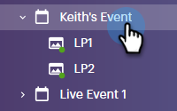
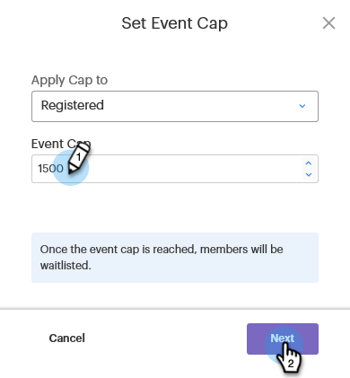
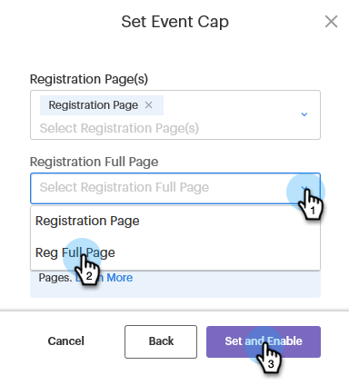

# Een gebeurtenissenkaart instellen {#setting-an-event-cap}

Beperk het aantal personen dat zich voor uw gebeurtenis kan registreren met een limiet voor gebeurtenissen.

>[!NOTE]
>
>Niet alle klanten hebben deze functie aangeschaft. Neem voor meer informatie contact op met de succesmanager van de klant.

>[!IMPORTANT]
>U moet ten minste twee goedgekeurde openingspagina&#39;s (een registratiepagina en een volledige registratiepagina) in het programma hebben voordat u een uiteinde voor de gebeurtenis kunt instellen.

1. Selecteer uw gebeurtenisprogramma.

   

1. In het Overzicht, vind [!UICONTROL Event Cap] en klik op **[!UICONTROL Not Set]**.

   

1. Voer het maximale aantal personen in dat u voor uw gebeurtenis wilt registreren en klik op **[!UICONTROL Next]**.

   

1. Klik op de knop [!UICONTROL Registration Page] en selecteer de bestemmingspagina die als registratiepagina zal fungeren.

   

1. Klik op de knop **[!UICONTROL Registration Full Page]** en selecteer de openingspagina die als de volledige registratiepagina zal fungeren. Klikken **[!UICONTROL Set and Enable]** wanneer gereed.

   

   Jullie zijn klaar. Als u besluit dat u de gegevens van de gebeurtenissenkapitaal wilt bewerken, klikt u op de blauwe tekst naast [!UICONTROL Event Cap] en herhaal deze stap uit stap 3.

   
