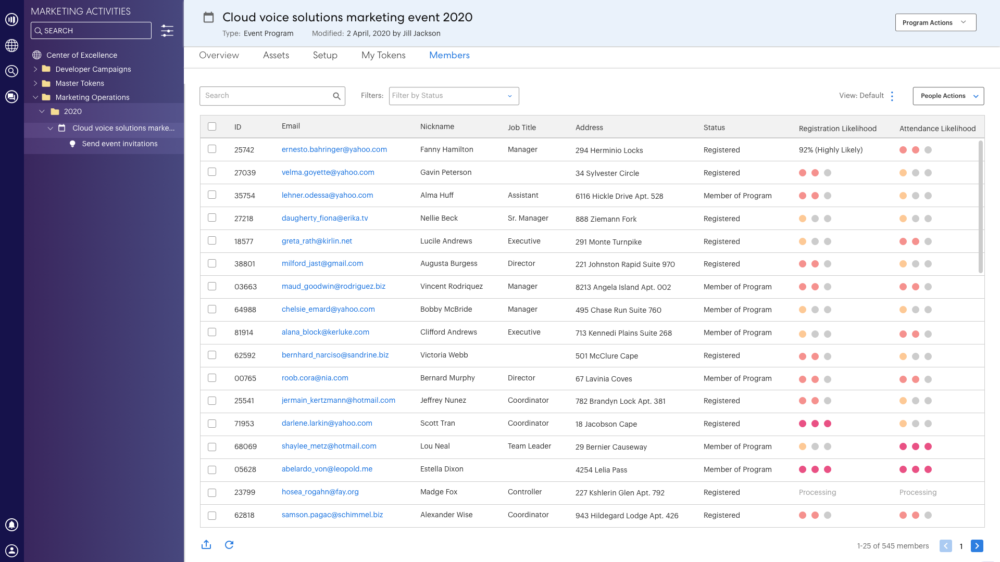

# Begrijpen van Goal Tracking en Geprojecteerde Registraties {#understanding-goal-tracking-and-projected-registrations}

Na [gebeurtenisdoelen instellen](/help/marketo/product-docs/marketo-sky/setting-event-goals.md) en uitnodigingen verzenden via een [slimme campagne](/help/sky/create-a-smart-campaign.md), hier is hoe je je doelvooruitgang kunt volgen en Marketo-voorspellingen kunt begrijpen.

>[!NOTE]
>
>Wanneer een gebeurtenisprogramma in de Marketo Classic-ervaring wordt gemaakt, wordt de begindatum van de gebeurtenis momenteel standaard ingesteld op de aanmaakdatum van de gebeurtenis. Aangezien bij geplande registraties rekening wordt gehouden met de hoeveelheid tijd die voor de begindatum van een gebeurtenis valt, is het mogelijk dat deze getallen niet accuraat zijn als de begindatum en de aanmaakdatum gelijk zijn (tenzij dit opzettelijk is ingesteld).

## Goederenregistratie en verwachte registratie {#goal-tracking-and-projected-registrations}

1. U kunt de volgende gegevens over het volgen van de doelstellingen vinden in het dialoogvenster **[!UICONTROL Reports]** van uw gebeurtenisprogramma. In dit specifieke voorbeeld zijn er tot nu toe 150 geregistreerde leden tegen een doelstelling van 200 (75%).

   

U ziet ook uw **[!UICONTROL Projected]** registraties. Houd de muisaanwijzer boven het informatiepictogram om een uitsplitsing van dit getal per Likelihood-segment te zien.

>[!NOTE]
>
>Het bijgewoond en Hoger diagram blijft leeg tot de dag van de gebeurtenis.

1. Klik op de schakeloptie Diagram om naar een verdeling van de leden te gaan op basis van de waarschijnlijkheid van registratie. U zult huidige registratiepercentages voor elk segment zien, in vergelijking met het gemiddelde percentage voor dat segment in uw vroegere programma&#39;s.

   

Alle leden (geregistreerd en nog niet geregistreerd) worden gecategoriseerd op basis van hun registratiewaarschijnlijkheid. Houd de muisaanwijzer boven het informatiepictogram om te zien hoe deze waarschijnlijkheidscategorieën zijn gedefinieerd.

>[!NOTE]
>
>De voorspellingsnummers worden elke 24 uur bijgewerkt tot de dag van de gebeurtenis. Alle leden die worden vermeld als _Verwerking_ worden opgenomen in de volgende berekeningscyclus.

## Vergelijkbare programma&#39;s {#similar-programs}

U kunt enig inzicht in uw huidige gebeurtenis verkrijgen door te bekijken hoe gelijkaardige programma&#39;s in het verleden werden uitgevoerd. In dit gedeelte worden maximaal vijf vergelijkbare programma&#39;s vanaf de afgelopen zes maanden weergegeven, met het aantal/percentage leden dat _Geregistreerd_ of hoger.

Bij de berekening van vergelijkbare programma&#39;s nemen we onder andere de volgende factoren in aanmerking:

* Programmatype
* Programmakanaal
* Grootte publiek
* Programmacodes
* Tijdsduur vanaf het maken van gebeurtenissen tot het starten van de gebeurtenis
* Gebeurtenisduur

   

## Recommendations {#recommendations}

Bij de bovenkant van de pagina van Rapporten, kunt u AI/ML-gedreven aanbevelingen vinden die op uw vooruitgang worden gebaseerd. Kom regelmatig terug voor nuttige tips en inzichten!

## Predicties op persoonlijk niveau {#person-level-predictions}

Klik op de knop **[!UICONTROL Members]** om al uw programmaleden weer te geven. Houd de aanwijzer boven de **[!UICONTROL Registration Likelihood]** of **[!UICONTROL Attendance Likelihood]** balken om exacte percentages en categorieën te zien. Vervolgens kunt u actie ondernemen tegen leden in een bepaalde categorie (bijvoorbeeld iedereen in de categorie &quot;Minder waarschijnlijk&quot; om zich te registreren) en u kunt deze specifiek richten op het mogelijk verhogen van uw registratienummers.

>[!NOTE]
>
>Bij de individuele waarschijnlijkheid wordt rekening gehouden met meer dan 40 factoren, waaronder profielkenmerken, activiteiten van personen en eerder uitgenodigde/geregistreerde/bijgewoonde activiteiten.

## Veelgestelde vragen {#faq}

**V: Wat is het segment?**

A: Registreren is waarschijnlijk een waarde tussen 0 en 100. Elke persoon die lid is van het gebeurtenisprogramma krijgt een waarde tussen 0 en 100.

Wij plaatsen waarschijnlijkheidswaarden in drie segmenten:

* Waarschijnlijkheid om >50% te registreren = Zeer waarschijnlijk segment
* Waarschijnlijkheid om >25% tot &lt;50% te registreren = Waarschijnlijk segment
* Waarschijnlijkheid om &lt;25% = Minder Waarschijnlijk segment te registreren

Wanneer een persoon zich waarschijnlijk registreert, zal de voorspelling in één van deze segmenten vallen (elke persoon die lid van een programma is zal in één van hen vallen). Als een gebeurtenisprogramma bijvoorbeeld 1000 leden heeft op basis van de waarschijnlijkheidsvoorspellingen, worden deze 1000 verdeeld in _Zeer waarschijnlijk_, _Waarschijnlijk_, of _Minder waarschijnlijk_ segmenten.

Daarom hebben mensen die in het hoogwaarschijnlijke segment vallen een grotere kans om zich voor de gebeurtenis te registreren.

Omzetting naar register = aantal geregistreerde personen gedeeld door # van personen die in het segment vallen (bijvoorbeeld - als 100 personen in het hoogst waarschijnlijke segment vallen en 60 daarvan zich registreren, is de omrekeningskoers 60%).

Conversie % naar register volgt dit patroon: Zeer waarschijnlijk > Waarschijnlijk > Minder waarschijnlijk.

**V: Hoe gebruik ik de inzichten?**

A: De beste praktijken omvatten het volgende:

i. U maakt een programma en vervolgens gebruikt een slimme campagne voorspellende filters met &quot;groter dan X&quot;, wat zou leiden tot een bepaalde hoeveelheid personen (bijvoorbeeld 1000) en u voert de campagne uit.

ii. Na 24 uur in de [!UICONTROL Reports] kunt u de geprojecteerde registraties zien die worden berekend op basis van de waarschijnlijkheid om waarden te registreren van alle mensen die momenteel worden uitgenodigd.

iii. Als geprojecteerde registraties kleiner zijn dan het doel, moet u meer mensen uitnodigen. Op dit moment zie je de inzichten die je vertellen wat de drempel was die werkte in eerdere programma&#39;s.

iv. U kunt een nieuwe Slimme Campagne met die drempel tot stand brengen om meer mensen uit te nodigen.

v. Op elk gewenst moment kunt u, als u wilt begrijpen waarom een geprojecteerd getal wordt weergegeven, schakelen om de publieksspreiding over segmenten, de conversietarieven uit het verleden en deze conversietarieven op het huidige publiek toe te passen (zie onderstaande schermafbeelding).

**V: Wat is de grafiek Segmenten door Registratie?**

A: Drie staven, die elk een segment vertegenwoordigen (Zeer waarschijnlijk, Waarschijnlijk, Minder Waarschijnlijk).

**Paarse stippellijn:** Gemiddeld gesprekstarief aan registratie in dat segment, dat op vroegere gelijkaardige programma&#39;s wordt gebaseerd.

**Blauwe balk:** Het percentage van de registratie van alle mensen in dat segment.

Stel bijvoorbeeld dat 100 mensen waarschijnlijk meer dan 50% en meer dan 60 van de 100 geregistreerde personen registreren. Zeer waarschijnlijk heeft 60% conversie. Dus alle leden die aan het programma worden toegevoegd, krijgen de kans om waarden te registreren, dan worden ze in segmenten gezet en volgens het aantal personen dat in elke segmentconversiesnelheid is geregistreerd, wordt berekend.

**V: Wat betekent &quot;Geregistreerd en Hoger&quot;?**

A: Elke persoon die als geregistreerd staat vermeld, of elke andere status met een gelijk of hoger stapnummer.

U kunt nieuwe progressiestatus voor een gebeurtenisprogramma creëren, maar wij brengen die statussen met standaardstatussen in kaart. Neem bijvoorbeeld een geval waarin een persoon wordt verplaatst van uitgenodigd naar herinnerd, wat een hogere stap is dan het registreren. Deze persoon zal ook als geregistreerd en getoond in het doel volgen worden beschouwd.

**V: Hoe worden geplande registraties berekend?**

A: Zie hieronder.

