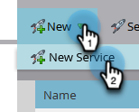

# Vibes toevoegen als een LaunchPoint-service {#add-vibes-as-a-launchpoint-service}

U kunt SMS-berichten verzenden naar de mensen die u hebt aangemeld voor uw SMS-campagnes van Vibes, waarbij u gebruik maakt van SMS-activiteiten om campagnes op een navitale manier te activeren en filteren in uw Marketo Engage-exemplaar. Eerst, moet u Lagen als dienst toevoegen LaunchPoint.

>[!NOTE]
>
>**Vereiste Bevoegdheden Admin**

>[!AVAILABILITY]
>
>U moet een actieve Vibes-account en een Adobe-licentie voor Vibes SMS hebben. De native integratie van Marketo Vibes SMS is beschikbaar in de VS en Canada. Voor andere landen, kan een verbinding via Webhooks van Marketo worden gebruikt door [ direct het contacteren van Lagen ](https://www.vibes.com/talk-to-sales){target="_blank"}.

1. Ga in Mijn Marketo naar het gebied **[!UICONTROL Admin]** .

   

1. Klik op **[!UICONTROL LaunchPoint]**.

   

1. Klik op **[!UICONTROL New]** en vervolgens op **[!UICONTROL New Service]** .

   

1. Voer een weergavenaam in en selecteer **[!UICONTROL Vibes]** in de vervolgkeuzelijst.

   

1. Voer onder Instellingen uw Vibes [!UICONTROL Username] , [!UICONTROL Password] en [!UICONTROL Company Key] in (die allemaal in uw Vibes-account staan). Klik op **[!UICONTROL Create]**.

   

   De nieuwe SMS-service wordt nu weergegeven in de lijst [!UICONTROL Installed Services] .

   

>[!MORELIKETHIS]
>
>[ Videodemo van Vibes ](https://vimeo.com/215233767/1ed136adbc){target="_blank"}
