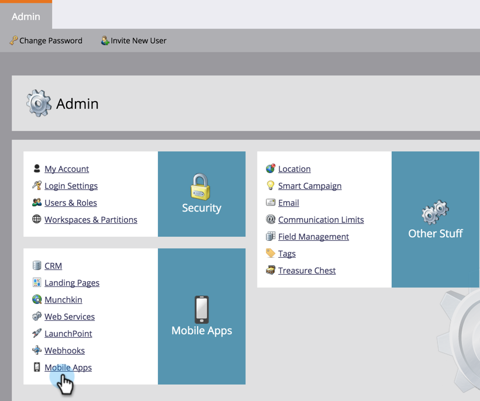

# Mobile App Android Push Access configureren {#configure-mobile-app-android-push-access}

1. Klik op **[!UICONTROL Admin]**.

   

1. Selecteer **[!UICONTROL Mobile Apps]** .

   

1. Selecteer de gewenste mobiele app.

   

1. Selecteer **[!UICONTROL Push Access Type]** onder **[!UICONTROL Android]** en klik op **[!UICONTROL Configure]** .

   

   >[!NOTE]
   >
   >U hebt een **[!UICONTROL Server API Key]** en **[!UICONTROL Project Number]** nodig van uw ontwikkelaar van mobiele apps. De ontwikkelaar ontvangt deze gegevens door u aan te melden bij de [!DNL Google Play Developer Console] om uw app te registreren en cloudberichten in te schakelen.

1. Voer de [!UICONTROL Server API Key] en [!UICONTROL Project Number] in. Klik op **[!UICONTROL Save]**.

   

   Zoet. Zorg ervoor dat u de app configureert met [!UICONTROL iOS] .

>[!MORELIKETHIS]
>
>[ vorm Mobiele App iOS Push Access ](/help/marketo/product-docs/mobile-marketing/admin/configure-mobile-app-ios-push-access.md)
