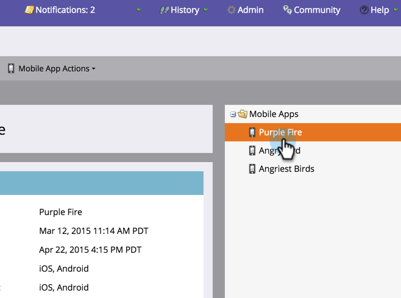

# SDK-code naar een ontwikkelaar verzenden {#send-sdk-code-to-a-developer}

Voordat u in-app berichten of pushmeldingen kunt maken, moet uw ontwikkelaar de Mobile App SDK voor de Android- en iOS-platforms hebben ingesteld en geïnitialiseerd.

* [&#x200B; Instructies voor Android &#x200B;](https://experienceleague.adobe.com/en/docs/marketo-developer/marketo/mobile/installation#how-to-install-marketo-sdk-on-android)
* [&#x200B; Instructies voor iOS &#x200B;](https://experienceleague.adobe.com/en/docs/marketo-developer/marketo/mobile/installation#how-to-install-marketo-sdk-on-ios)

## SDK-code naar een ontwikkelaar verzenden {#send-sdk-code-to-a-developer-1}

Soms moet een beheerder SDK-code naar een ontwikkelaar verzenden.

Zo doe je het.

1. Klik op **[!UICONTROL Admin]**.

   

1. Selecteer **[!UICONTROL Mobile Apps]**.

   

1. Selecteer de gewenste mobiele app.

   

1. Klik op **[!UICONTROL Mobile App Actions]** en selecteer **[!UICONTROL Send to Developer]** .

   

1. Voer een e-mailadres in en klik op **[!UICONTROL Send]** .

   

   De SDK-code wordt nu naar uw ontwikkelaar verzonden.
