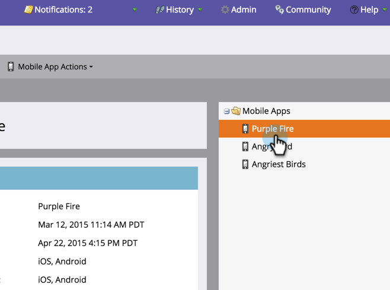

# SDK-code verzenden naar een ontwikkelaar {#send-sdk-code-to-a-developer}

Voordat u berichten of pushmeldingen in de app kunt maken, moet de ontwikkelaar de SDK van de Mobile App voor de Android- en iOS-platforms hebben ingesteld en geïnitialiseerd.

* [Instructies voor Android](https://developers.marketo.com/documentation/mobile/installation-instructions-on-android/)
* [Instructies voor iOS](https://developers.marketo.com/documentation/mobile/installation-instructions-on-ios/)

## SDK-code verzenden naar een ontwikkelaar {#send-sdk-code-to-a-developer-1}

Soms moet een beheerder enige SDK-code naar een ontwikkelaar verzenden.

Zo doe je het.

1. Klik **Admin**.

   

1. Selecteer **Mobiele toepassingen**.

   

1. Selecteer de gewenste mobiele app.

   

1. Klik **Mobiele App-handelingen** en selecteer **Verzenden naar ontwikkelaar**.

   

1. Voer een e-mailadres in en klik op **Verzenden**.

   

   De SDK-code wordt nu naar de ontwikkelaar verzonden.
