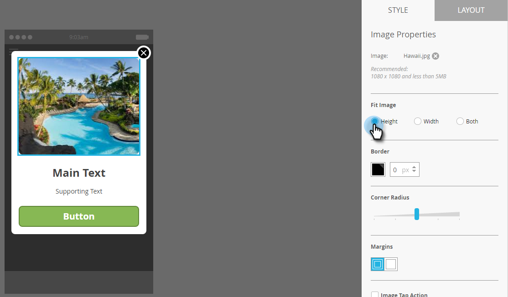
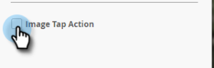
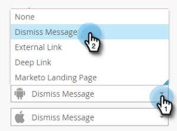

# Berichtafbeeldingen in de app toevoegen {#add-in-app-message-images}

Hier kiest en past u uw in-app berichtafbeeldingen aan.

1. Selecteer het bericht in de app en klik op Concept **** bewerken.

   

1. Kies een van de zes sjablonen op het tabblad Indeling. Er zijn drie opties voor Pop-up en drie opties voor Volledig scherm.

   >[!TIP]
   >
   >Wat is het verschil tussen de sjablonen? Zie Een lay-out [kiezen voor uw bericht](/help/marketo/product-docs/mobile-marketing/in-app-messages/creating-in-app-messages/choose-a-layout-for-your-in-app-message.md) in de app voordat u aan de slag gaat.

   

1. Klik op het tabblad **Stijl** en klik in het afbeeldingsgebied van de sjabloon.

   

1. Klik op Afbeelding **** selecteren.

   

1. Selecteer uw afbeelding in de Design Studio en klik op **Selecteren**.

   

   >[!NOTE]
   >
   >Afbeeldingsgrootte is beperkt tot 1440 x 2560 px en 5 MB.

1. Bent u van mening en wilt u een andere afbeelding gebruiken? Geen probleem. Klik op de **X** naast de bestandsnaam van de afbeelding.

   

1. Klik op **Verwijderen**. Nu kun je een andere kiezen.

   

1. Selecteer, terwijl de gewenste afbeelding op zijn plaats staat, in Afbeeldingseigenschappen een knop waarmee u de afbeelding kunt laten afstemmen op Hoogte, Breedte of Beide.

   

1. Pas eventueel een afbeeldingsrand toe. De standaardinstelling is **Uit**. Selecteer eerst kleur door erop te klikken of door de Hex- of RGB-nummers in te voeren in de kleurkiezer.

   

1. Klik op de pijlen om de randbreedte in pixels te wijzigen. U zult zien dat het op de afbeelding verandert.

   

1. Selecteer een hoekstraal met de schuifregelaar. Selecteer een positie van links naar rechts: 0, 4, 8, 12 of 16 pixels. De standaardinstelling is 8-pixel (middelste selectie).

   

1. Selecteer een marge (aan of uit). **Aan** is de standaardinstelling.

   

1. Schakel het selectievakje in om een actie voor het tikken van afbeeldingen te definiëren.

   

1. Er is een afzonderlijke actie voor elk platform (zie Nota).

   

1. Klik op elke vervolgkeuzelijst om de opties weer te geven. Selecteer een optie.

   

   >[!NOTE]
   >
   >Voor tikacties voor afbeeldingen, knoppen of achtergronden kunt u verschillende handelingen instellen voor Apple- en Android-platforms. Diepe koppelingen worden bijvoorbeeld op verschillende manieren afgehandeld voor Apple en Android. Als uw bericht slechts naar één platform of andere gaat, verlaat andere in het gebrek plaatsend of selecteer **niets**.

Geweldig werk! Het is nu tijd om de tekst voor uw bericht [in de app te](/help/marketo/product-docs/mobile-marketing/in-app-messages/creating-in-app-messages/create-in-app-message-text.md)maken.

>[!MORELIKETHIS]
>
>* [In-app berichten begrijpen](/help/marketo/product-docs/mobile-marketing/in-app-messages/understanding-in-app-messages.md)
>* [Kies een lay-out voor uw bericht in de app](/help/marketo/product-docs/mobile-marketing/in-app-messages/creating-in-app-messages/choose-a-layout-for-your-in-app-message.md)

