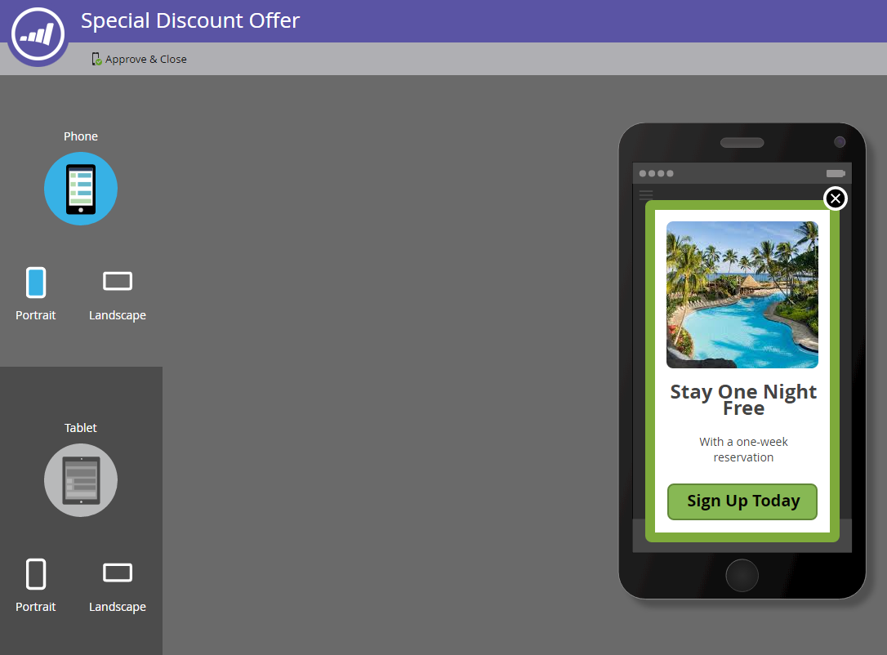

# De knop Ontwerpen instellen en het bericht {#set-up-the-dismiss-button-and-approve-the-message} goedkeuren

## Eigenschappen van knop Afwijzen configureren {#configure-dismiss-button-properties}

De knoop van de Ontkenning heeft vele opties om u het te laten vormen zoals u wilt.

1. Klik in de editor op de knop Afwijzen.

   

1. Als u de kleur van de knop wilt wijzigen, klikt u op het vierkantje van de kleurselectie. Selecteer een kleur door erop te klikken of de hexadecimale of RGB-nummers in te voeren in de kleurkiezer. Zwart is de standaardinstelling.

   

1. Selecteer een knopontwerp in de keuzelijst. De ronde knoppen bevatten een volledige kleur en een verloopoptie.

   

   >[!CAUTION]
   >
   >De knopkleur kan als een witte X op een witte achtergrond worden weergegeven wanneer u een ander ontwerp selecteert in het keuzemenu. Als dit het geval is, selecteert u gewoon zwart of een andere kleur in het gekleurde selectievierkant om de witte X zichtbaar te maken.

1. U kunt op de linkerhoekknop klikken om de knop Afwijzen naar links te verplaatsen (de rechterkant is de standaardinstelling).

   

1. Klik op de vervolgkeuzelijst voor elk platform en selecteer een tikactie voor de knop Afwijzen.

   

   >[!NOTE]
   >
   >U moet de knop Afwijzen een tikactie geven, dus er is geen selectievakje om deze in te schakelen. Bericht negeren is de (voor de hand liggende) standaardkeuze.

## {#wrap-it-up} omsluiten

Alle selecties voor de afbeeldingen, tekst en knoppen zijn automatisch opgeslagen. Nu ben je klaar om het werk af te maken.

1. Als u een voorbeeld van uw bericht in de app wilt bekijken, klikt u op de vervolgkeuzelijst **Berichthandelingen** en selecteert u **Voorvertoning**.

   

1. Geef een voorvertoning van het bericht in de app weer op de telefoon of tablet om te controleren of het bericht correct wordt weergegeven.

   

1. Als u tevreden bent met het in-app bericht, klik **Goedkeuren &amp; Sluiten**.

   

   >[!NOTE]
   >
   >U kunt **Goedkeuren &amp; Sluiten** van de drop-down Acties van het Bericht ook selecteren (zie stap 1), maar waarom niet voorproef eerst het bericht, enkel om veilig te zijn?

1. Als u de editor wilt sluiten zonder deze goed te keuren, sluit u gewoon het tabblad. Het wordt automatisch opgeslagen, zodat kunt u het later terugkeren en goedkeuren.

   

Zoveel keuzes, maar nu heb je een geweldige boodschap in de app, klaar om te gaan!

Nu is het tijd om [uw bericht te verzenden](https://docs.marketo.com/display/docs/send+your+in-app+message).

>[!MORELIKETHIS]
>
>* [In-app berichten begrijpen](../../../../product-docs/mobile-marketing/in-app-messages/understanding-in-app-messages.md)
>* [Uw bericht in de app verzenden](https://docs.marketo.com/display/docs/send+your+in-app+message)
>* [Kies een lay-out voor uw bericht in de app](choose-a-layout-for-your-in-app-message.md)

>

