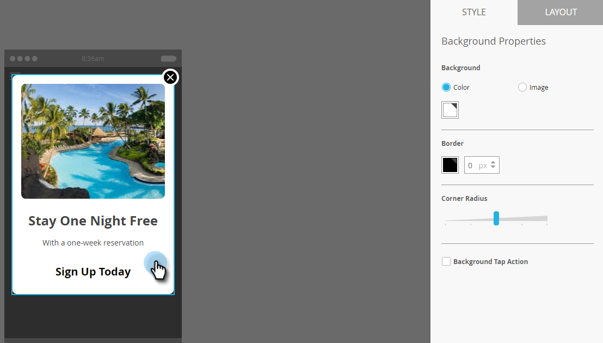
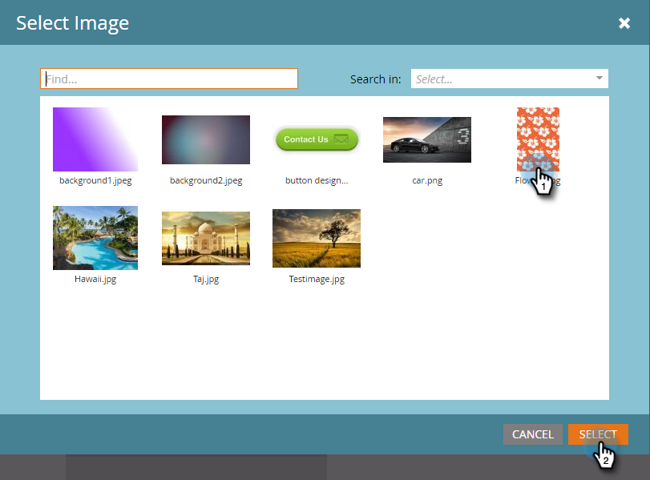

# De achtergrond voor berichten in de app instellen {#set-up-the-in-app-message-background}

Het selecteren van een berichtachtergrond is een belangrijke stap in het voltooien van uw bericht in de app.

>[!TIP]
>
>Voor achtergrondafbeeldingen werken structuren en verlopen meestal het beste.

1. Klik in de editor op de achtergrond.

   

1. Als u een kleur wilt instellen, klikt u op **[!UICONTROL Color]** en vervolgens op het vierkantje van de kleurselectie. Selecteer de kleur door erop te klikken of de Hex- of RGB-codes in te voeren in de kleurkiezer.

   

   >[!NOTE]
   >
   >Normaal gesproken is wit, de standaardinstelling, de winnaar.

1. Als u een achtergrond wilt gebruiken, klikt u op **[!UICONTROL Image]** en vervolgens op de koppeling **[!UICONTROL Select Image]** .

   

1. Kies uit bestanden die naar de Design Studio zijn geüpload. Klik op **[!UICONTROL Select]**.

   

   >[!NOTE]
   >
   >Afbeeldingsgrootte is beperkt tot 1440 x 2560 px en 5 MB.

1. Evalueer de resultaten. Misschien werkt een normale kleur, structuur of verloop beter!

   

1. Pas een optionele afbeeldingsrand toe. De standaardinstelling is **[!UICONTROL Off]** . Selecteer eerst de kleur door erop te klikken of voer de Hex- of RGB-nummers in op de kleurkiezer.

   

1. Klik op de pijlen om de randbreedte te variëren. Deze groene rand van 12 pixels breed verandert het uiterlijk van het bericht in de app.

   

1. Selecteer een hoekstraal met de schuifregelaar. Selecteer een positie van links naar rechts: 0, 4, 8, 12 of 16 pixels. De standaardinstelling is 8-pixel (middelste selectie).

   

1. Schakel het selectievakje in om de actie voor tikken op de achtergrond in te stellen (standaard uitgeschakeld).

   

   >[!NOTE]
   >
   >Voor tikacties voor achtergronden kunt u verschillende acties instellen voor Apple- en Android-platforms. Diepe koppelingen worden bijvoorbeeld anders afgehandeld voor Apple en Android. Als uw bericht slechts naar één platform of andere gaat, verlaat andere in het gebrek dat plaatst of **[!UICONTROL None]** selecteert.

   Om de baan te beëindigen, is uw laatste stap aan [ opstelling de knoop van de Verwerping ](/help/marketo/product-docs/mobile-marketing/in-app-messages/creating-in-app-messages/set-up-the-dismiss-button-and-approve-the-message.md).

   >[!MORELIKETHIS]
   >
   >* [ Begrijpend in-app Berichten ](/help/marketo/product-docs/mobile-marketing/in-app-messages/understanding-in-app-messages.md)
   >* [ verzend een Bericht In-App ](/help/marketo/product-docs/mobile-marketing/in-app-messages/sending-your-in-app-message/send-your-in-app-message.md)
   >* [ kies een Lay-out voor Uw Bericht In-App ](/help/marketo/product-docs/mobile-marketing/in-app-messages/creating-in-app-messages/choose-a-layout-for-your-in-app-message.md)
