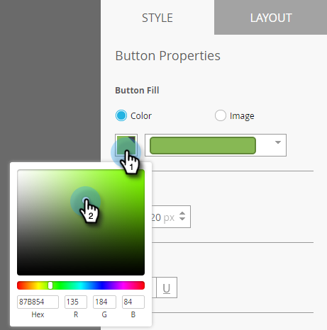

# De knop Bericht in de toepassing {#set-up-the-in-app-message-button} instellen

U kunt het standaardknopontwerp gebruiken, dit wijzigen of uw eigen aangepaste knopafbeelding uploaden.

1. Klik op de knop om het tabblad Stijl te openen voor bewerking.

   

1. Als u de kleur voor de standaardknop wilt wijzigen, klikt u op de knop **Kleur**.

   

1. Klik op het vierkantje voor kleurselectie en selecteer de knopkleur door erop te klikken of voer de hexadecimale of RGB-nummers in op de kleurkiezer.

   

1. Selecteer een vorm in de vervolgkeuzelijst. Tot de standaardvormkeuzen behoren scherpe hoeken, afgeronde hoeken en verlopen.

   

1. Als u uw eigen afbeelding voor een knop wilt gebruiken, klikt u op de knop Afbeelding en klikt u op **Afbeelding selecteren**.

   

1. Kies de afbeelding en klik op **Select**.

   

   >[!TIP]
   >
   >Wanneer u een aangepaste afbeelding voor de knop plaatst, kunt u overwegen de plaatsaanduidingstekst erboven te wissen als de afbeelding al tekst bevat.

1. Klik op het vierkantje voor kleurselectie en selecteer vervolgens de fontkleur door erop te klikken of door Hex- of RGB-nummers in te voeren in de kleurkiezer.

   

1. Klik op de pijlen om de tekengrootte te kiezen.

   

1. Kies een lettertypestijl voor de nadruk: **Vet**, _Cursief_ of Onderstrepen.

   

1. Klik op de knoptekst om deze inline te bewerken.

   

1. Schakel het selectievakje in om de tikactie voor de knop in te stellen.

   

1. Klik op de vervolgkeuzelijst voor elk platform en selecteer een tikactie.

   

   >[!NOTE]
   >
   >De knop heeft altijd een tikactie, zodat het selectievakje Actie tikken automatisch is ingeschakeld, met het standaardbericht &quot;Bericht negeren&quot;.

Bijna. Uw laatste stap bestaat uit het configureren van [de achtergrond van uw bericht in de app en het negeren van de knop](/help/marketo/product-docs/mobile-marketing/in-app-messages/creating-in-app-messages/set-up-the-in-app-message-background.md).

>[!MORELIKETHIS]
>
>* [In-app berichten begrijpen](/help/marketo/product-docs/mobile-marketing/in-app-messages/understanding-in-app-messages.md)
>* [Kies een lay-out voor uw bericht in de app](/help/marketo/product-docs/mobile-marketing/in-app-messages/creating-in-app-messages/choose-a-layout-for-your-in-app-message.md)

