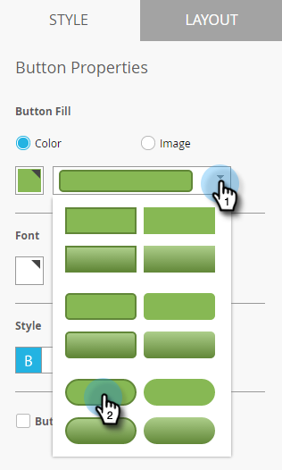

# De knop Bericht in de app instellen {#set-up-the-in-app-message-button}

U kunt het standaardknopontwerp gebruiken, wijzigen of uploaden.

1. Klik op de knop om het tabblad [!UICONTROL Style] te openen voor bewerking.

   

1. Als u de kleur voor de standaardknop wilt wijzigen, klikt u op de knop **[!UICONTROL Color]** .

   

1. Klik op het vierkantje voor kleurselectie en selecteer de knopkleur door erop te klikken of voer de Hex- of RGB-nummers in op de kleurkiezer.

   

1. Selecteer een vorm in de vervolgkeuzelijst. Tot de standaardvormkeuzen behoren scherpe hoeken, afgeronde hoeken en verlopen.

   

1. Als u uw eigen afbeelding voor een knop wilt gebruiken, klikt u op de knop **[!UICONTROL Image]** en klikt u op **[!UICONTROL Select Image]** .

   

1. Kies de afbeelding en klik op **[!UICONTROL Select]** .

   

   >[!TIP]
   >
   >Wanneer u een aangepaste afbeelding voor de knop plaatst, kunt u overwegen de plaatsaanduidingstekst erboven te wissen als de afbeelding al tekst bevat.

1. Klik op het vierkantje voor kleurselectie en selecteer de lettertypekleur door erop te klikken of door Hex- of RGB-nummers in te voeren in de kleurkiezer.

   

1. Klik op de pijlen om de tekengrootte te kiezen.

   

1. Kies doopvontstijl voor nadruk: **Vet**, _Cursief_, of onderstreept.

   

1. Klik op de knoptekst om deze inline te bewerken.

   

1. Schakel het selectievakje in om de tikactie voor de knop in te stellen.

   

1. Klik op de vervolgkeuzelijst voor elk platform en selecteer een tikactie.

   

   >[!NOTE]
   >
   >De knoop heeft altijd een tikactie, zodat wordt checkbox van de Actie van de Tik automatisch geselecteerd, met het standaardbericht &quot;[!UICONTROL Dismiss Message]&quot;.

Bijna. Uw laatste stap moet [ uw in-app berichtachtergrond vormen en knoop ](/help/marketo/product-docs/mobile-marketing/in-app-messages/creating-in-app-messages/set-up-the-in-app-message-background.md) sluiten.

>[!MORELIKETHIS]
>
>* [ Begrijpend in-app Berichten ](/help/marketo/product-docs/mobile-marketing/in-app-messages/understanding-in-app-messages.md)
>* [ Kies een lay-out voor uw [!UICONTROL In-App Message]](/help/marketo/product-docs/mobile-marketing/in-app-messages/creating-in-app-messages/choose-a-layout-for-your-in-app-message.md)
