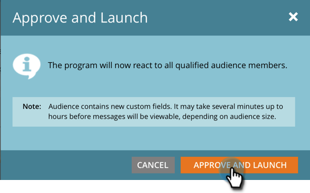

# Uw bericht in de app goedkeuren {#approve-your-in-app-message}

U moet de verzending goedkeuren voordat het bericht in de app wordt verzonden.

1. Klik op **[!UICONTROL Approve and Launch]** als alles er goed uitziet.

   

   >[!NOTE]
   >
   >Als een onderdeel van het verzendproces bijvoorbeeld onvolledig is, wordt het bericht in de app niet goedgekeurd, verschijnt er een waarschuwingsbericht waarin wordt aangegeven welk gebied uw aandacht verdient. Ga dat oplossen en u zou het bericht in stap 2 moeten zien.

1. Klik op **[!UICONTROL Approve and Launch]**.

   

1. Als u aangepaste velden hebt gebruikt, duurt het mogelijk langer om Marketo uit te voeren en wordt dit bericht weergegeven.

   

1. Het bericht is nu &quot;[!UICONTROL Active]&quot;.

   

   >[!NOTE]
   >
   >Doorgaans duurt het 15 tot 30 minuten voordat een goedgekeurd bericht in de app zichtbaar is voor bezoekers in uw programma. Houd er rekening mee dat als u aangepaste velden hebt gebruikt, dit enkele uren of langer kan duren.

   U kunt een actief programma pauzeren of stoppen, maar er is een groot verschil tussen deze twee opties.

1. Klik op **[!UICONTROL Pause Program]** als u het programma een tijdje moet stoppen, maar het later moet hervatten. De waarde verandert in **[!UICONTROL Paused]** status.

   

   >[!NOTE]
   >
   >De redenen voor het pauzeren zouden enkel kunnen zijn om het een tijdje tegen te houden, of als u het bericht wilt wijzigen of het programma aanpassen. U kunt echter niet naar een ander bericht gaan, alleen het bestaande bericht bewerken.

1. Klik op **[!UICONTROL Resume Program]** als u wilt dat het gepauzeerde programma doorgaat.

   

1. Als u het programma volledig wilt stoppen, klikt u op **[!UICONTROL Stop Program]** .

   

1. Klik op **[!UICONTROL Stop]** als u zeker weet dat u het programma wilt stoppen.

   

   >[!NOTE]
   >
   >Wanneer u een programma tegenhoudt, loopt het niet meer en kan niet worden hervat. Als je het opnieuw wilt uitvoeren, moet je het opnieuw bouwen. Zorg er dus voor dat u klaar bent met een programma voordat u op **[!UICONTROL Stop Program]** klikt!

## In-app-dashboard {#in-app-dashboard}

Nadat het programma is uitgevoerd, kunt u de prestaties controleren met het dashboard in de app. Dit wordt automatisch weergegeven nadat u het programma hebt goedgekeurd. Als u wilt terugkeren naar het programma, klikt u op de koppeling in de rechterbovenhoek en selecteert u **[!UICONTROL Control Panel]** .

Dat is alles, mensen!
