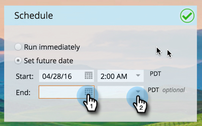

# Uw bericht in de app plannen {#schedule-your-in-app-message}

Verzend nu uw bericht of plant het voor later.

1. Als u een bericht in de app wilt plannen, selecteert u **[!UICONTROL Set future date]** en kiest u een begindatum in de vervolgkeuzelijst.

   

1. Selecteer een begintijd in de vervolgkeuzelijst.

   

1. De einddatum en -tijd zijn optioneel. Selecteer deze in de keuzelijst.

   

1. Of selecteer **[!UICONTROL Run Immediately]** om het programma nu uit te voeren. De velden Begindatum verdwijnen.

   

Eenvoudig! Last but not least is de [&#x200B; stap van de Goedkeuring &#x200B;](/help/marketo/product-docs/mobile-marketing/in-app-messages/sending-your-in-app-message/approve-your-in-app-message.md).
