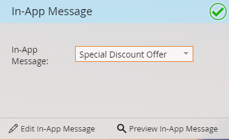

# Uw bericht in de toepassing selecteren {#select-your-in-app-message}

Hier selecteert u het bericht dat u hebt gemaakt voor gebruik in het programma.

1. Selecteer uw bericht in de app in de vervolgkeuzelijst.

   

   >[!NOTE]
   >
   >Alle berichten zijn beschikbaar om te selecteren, ongeacht waar ze wonen. Marketo voegt de bovenliggende naam aan elke naam toe, zodat u zeker weet dat elk bestand een unieke naam krijgt.

1. Nadat u het bericht hebt geselecteerd, is het klaar. U kunt deze bewerken of voorvertonen.

   

   >[!TIP]
   >
   >Als u een ander bericht wilt selecteren, verwijdert u dit in het veld Bericht in de app. Vervolgens wordt de koppeling Nieuw bericht in de app geretourneerd. Klik erop en selecteer een ander bericht.

Je bent op schema. Tijd aan [planning send](/help/marketo/product-docs/mobile-marketing/in-app-messages/sending-your-in-app-message/schedule-your-in-app-message.md).
