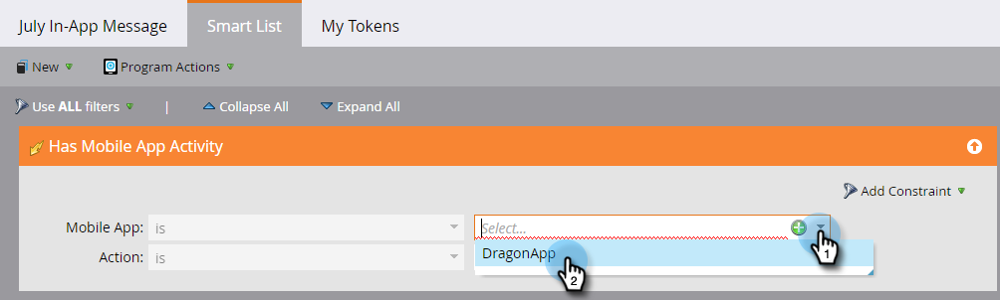

# Uw publiek voor berichten in de app instellen {#set-your-in-app-message-audience}

De eerste stap bestaat uit het bepalen van wie uw bericht in de app moet ontvangen. U moet uw slimme lijst instellen.

1. Klik op **[!UICONTROL Edit Smart List]**.

   

1. In de slimme lijst wordt de trigger **[!UICONTROL Has Mobile App Activity]** automatisch gevuld. Klik op de vervolgkeuzelijst en selecteer de app waarin u het bericht wilt plaatsen.

   

   >[!NOTE]
   >
   >Meerdere waarden voor het veld Mobile App worden momenteel niet ondersteund voor berichtprogramma&#39;s in de app.

1. **[!UICONTROL App Open]** is de standaardinstelling voor Handeling, maar u kunt elke aangepaste gebeurtenis selecteren die u al hebt ingesteld.

   

   >[!NOTE]
   >
   >De standaardtrigger ([!UICONTROL App Open]) en eventuele aangepaste triggers die door de ontwikkelaar aan de code worden toegevoegd, worden automatisch weergegeven in de [!UICONTROL Action] -kiezer. Als een aangepaste gebeurtenis ontbreekt, vraagt u uw ontwikkelaar of ze de aangepaste gebeurtenissen aan de app hebben toegevoegd. Vergeet niet dat het coderen en goedkeuren van aangepaste gebeurtenissen enige tijd kan duren. Zie [&#x200B; dit artikel &#x200B;](/help/marketo/product-docs/mobile-marketing/admin/before-you-create-push-notifications-and-in-app-messages.md) voor meer informatie.

1. Er zijn beperkingen beschikbaar voor de trigger **[!UICONTROL Has Mobile App Activity]** als u deze nodig hebt.

   

1. U kunt filters aan uw slimme lijst toevoegen om te beperken wie uw in-app bericht ontvangt. In dit voorbeeld wordt met het filter **[!UICONTROL Acquisition Date]** alleen het bericht in de app verzonden aan personen die op 9 juni 2016 zijn aangeschaft.

   

1. Ga terug naar het Configuratiescherm van uw bericht in de app. Stel de weergavelimiet in de vervolgkeuzelijst in.

   

   >[!NOTE]
   >
   >De standaardweergavelimiet is **[!UICONTROL Once per session]** . Selecteer **[!UICONTROL Every time until tapped]** als u wilt dat het bericht niet meer wordt weergegeven nadat de ontvanger heeft gereageerd. Kies **[!UICONTROL Every time]** als deze telkens moet worden weergegeven, ongeacht wat de ontvanger doet.

   

Mooi werk! Je hebt je publiek ingesteld. Je hebt de blauwe balk en het groene vinkje verdiend.

Tijd aan [&#x200B; selecteert uw in-app bericht &#x200B;](/help/marketo/product-docs/mobile-marketing/in-app-messages/sending-your-in-app-message/select-your-in-app-message.md)!
