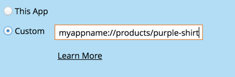

# Melding van mobiele pushberichten configureren {#configure-mobile-push-notification}

1. Ga naar het **Op de markt brengende Activiteiten** gebied.

   

1. Selecteer uw duw activa en klik **uitgeven Ontwerp**.

   

1. In **Opstelling**, selecteer uw gewenste app. Android- en Apple-platforms zijn standaard ingeschakeld.

   

   >[!NOTE]
   >
   >Als uw Push bericht op slechts één platform (b.v., iOS) van toepassing is, kunt u het andere platform uitsluiten door zijn selecteur aan **Gehandicapten** manueel te schuiven.

1. Klik **daarna**.

   

1. Ga berichttekst in of selecteer het symbolische pictogram om tokens toe te voegen (in deze redacteurstokens worden geformatteerd [ aangezien zij gewoonlijk ](/help/marketo/product-docs/demand-generation/landing-pages/personalizing-landing-pages/tokens-overview.md) zijn - u kunt veelvoudige tokens gebruiken). Selecteer de Actie van de a **Tik**.

   

   >[!NOTE]
   >
   >Als een platform wordt toegelaten, verschijnt het op de linkerkant van de vertoning van het telefoonscherm. Het wordt in kleur weergegeven wanneer het is geselecteerd.

   >[!NOTE]
   >
   >Er zijn drie typen Tap-handelingen:
   >
   >**Toepassing van de Lancering** - **Deze app** opent de homepage van uw app wanneer het bericht wordt getikt. **Douane** gebruikt een diepe verbinding om andere gebieden van uw app of een andere app te openen waaraan u de verbinding hebt (zie [ Diep Verbinding URIs ](#deep-link-uris) hieronder voor details).
   >
   >**het Bestaan Pagina** - neemt u aan een gespecificeerde Marketo landende pagina.
   >
   >**Externe URL** - neemt u aan een niet-Marketo landende pagina.

1. Om een diepe verbinding voor een actie van de douankraan op te nemen, selecteer **Douane** en ga [ diepe verbinding URI ](#deep-link-uris) op het gebied in.

   

   >[!NOTE]
   >
   >Berichten en Tap-handelingen zien er op beide platforms hetzelfde uit.

1. Alleen voor iOS: schakel het selectievakje in om de app te vertellen dat een geluid moet worden afgespeeld wanneer het bericht arriveert. Android speelt het geluid automatisch af.

   

1. Voorproef het andere platform en klik **Afwerking**.

   

1. Klik **goedkeuren en sluiten**.

   

Gefeliciteerd! De pushmelding kan nu worden verzonden.

## Diepe koppeling-URI&#39;s {#deep-link-uris}

Wanneer abonnees op een knop in een pushbericht klikken, kunnen ze deze naar de homepage van uw app of rechtstreeks naar een specifieke pagina in de app sturen. Een diepe koppeling is een unieke verwijzing naar een specifieke pagina in uw app en ziet er veel uit als een websitekoppeling.

Een diepe verbinding URI bestaat uit drie delen: schemanaam, weg, en herkenningsteken. In het onderstaande voorbeeld is &quot;myappname&quot; het schema. &quot;products&quot; is het pad en &quot;purple-shirt&quot; is de id. Wanneer de klant tikt, worden deze specifiek naar het paarse shirt-item op de productpagina&#39;s van uw app geleid.

De structuur van de diepe koppeling in uw app kan echter afwijken van het bovenstaande voorbeeld. Uw ontwikkelaar heeft vele opties in het bepalen van diepe verbinding URI&#39;s, zodat vraag uw ontwikkelaar om u URIs (verbindingen) voor de pagina&#39;s te verzenden u geinteresseerd bent in het gebruiken. Zo zorgt u ervoor dat de URI&#39;s die u invoert in de pushberichten naar de juiste plaatsen verwijzen. Uw ontwikkelaar kan [ hier meer informatie ](https://experienceleague.adobe.com/en/docs/marketo-developer/marketo/mobile/enabling-deep-links-in-your-app) vinden.

>[!MORELIKETHIS]
>
>[ verzend een Mobiel Push Bericht ](/help/marketo/product-docs/mobile-marketing/push-notifications/send-a-mobile-push-notification.md)
