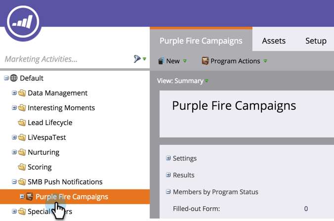

# Een pushmelding maken {#create-a-push-notification}

Het is eenvoudig om een pushmelding te maken. Voordat u echter begint, moet uw Marketo Admin en Mobile Apps Developer een aantal zaken hebben ingesteld die u nodig hebt terwijl u dit doet. Zie [ Begrijpend de Berichten van de Duw ](/help/marketo/product-docs/mobile-marketing/push-notifications/understanding-push-notifications.md) voor details.

1. Ga naar het **[!UICONTROL Marketing Activities]** -gebied.

   

1. Zoek en selecteer uw programma.

   

1. Klik onder **[!UICONTROL New]** op **[!UICONTROL New Local Asset]** .

   

1. Selecteer **[!UICONTROL Push Notification]**.

   

1. Ga de Naam van het a **Push Bericht** in en klik **[!UICONTROL Create]**.

   

   Zoet! Nu het Duwbericht wordt gecreeerd, gaan vooruit en [ het omhoog kleven ](/help/marketo/product-docs/mobile-marketing/push-notifications/configure-mobile-push-notification.md).
