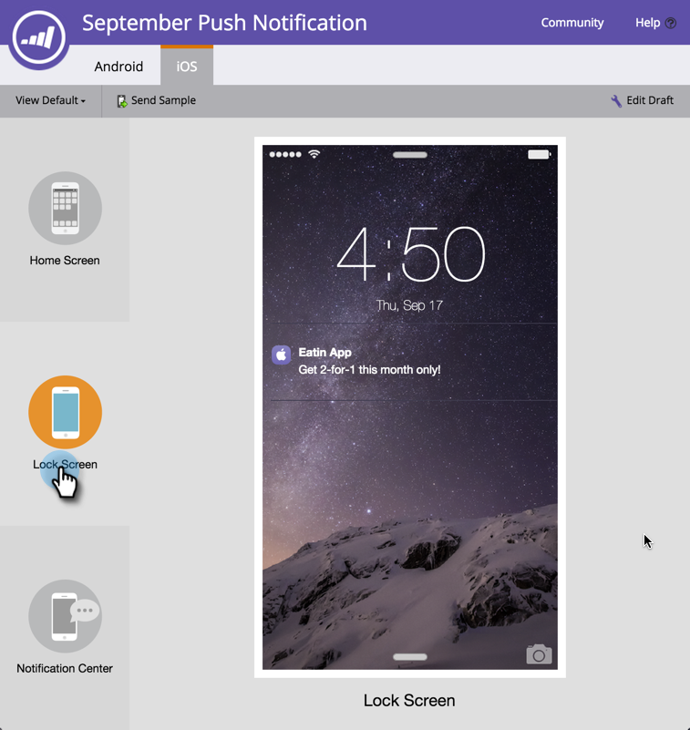

# Een voorbeeld van een pushmelding bekijken {#preview-a-push-notification}

Het is eenvoudig om een voorvertoning te bekijken van hoe je pushmelding eruitziet voor Android of iOS. Er zijn vier manieren om het te doen.

Klik in de navigatiestructuur met de rechtermuisknop op het bestand voor de melding die u wilt voorvertonen en klik op **[!UICONTROL Preview]** .

>[!NOTE]
>
>Als pushmelding voor slechts één platform is ingeschakeld, wordt de tab voor het andere platform niet weergegeven.

Of klik op de weergavepagina Push Notification op **[!UICONTROL Push Notifications Actions]** en vervolgens op **[!UICONTROL Preview]** . Of klik helemaal rechts op **[!UICONTROL Preview]** .

Tot slot kunt u in de redacteur, het **[!UICONTROL Preview Draft]** lusje in het hogere recht klikken terwijl u aan het bericht werkt.

## Android-voorvertoningen {#android-previews}

Klik op het pictogram aan de linkerkant om precies te zien waar het pushbericht wordt weergegeven wanneer u het verzendt. Klik of gebruik toetsenbordpijlen om tussen hen van een knevel te voorzien.

Op het Basisscherm verschijnt de melding iets onder de bovenkant, onder de pictogrammen.

Op het scherm van het Slot, springt het omhoog partway, onder de tijd.

>[!NOTE]
>
>Er is geen Berichtencentrum-weergave in Android.

## iOS-voorvertoningen {#ios-previews}

Net als bij Android klikt of gebruikt u pijltoetsen op het toetsenbord om te schakelen tussen de weergaven.

Op het Homescherm verschijnt het bericht bovenaan.

Op het scherm van het Slot, toont het partway neer.

Op het scherm van het Centrum van het Bericht, is het omhoog dichtbij de bovenkant,

Met de voorvertoning van pushberichten weet u dus altijd wat uw klanten gaan zien.

>[!MORELIKETHIS]
>
>* [&#x200B; creeer een Duw Bericht &#x200B;](/help/marketo/product-docs/mobile-marketing/push-notifications/create-a-push-notification.md)
>* [&#x200B; Vorm Mobiel Push Bericht &#x200B;](/help/marketo/product-docs/mobile-marketing/push-notifications/configure-mobile-push-notification.md)
