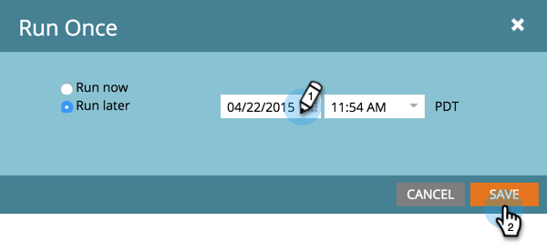

# Een mobiel pushbericht verzenden {#send-a-mobile-push-notification}

Stuur een pushmelding naar mensen die uw mobiele app gebruiken.

>[!PREREQUISITES]
>
>* [ creeer een Nieuwe Slimme Campagne ](/help/marketo/product-docs/core-marketo-concepts/smart-campaigns/creating-a-smart-campaign/create-a-new-smart-campaign.md)
>* [ creeer een Duw Bericht ](/help/marketo/product-docs/mobile-marketing/push-notifications/create-a-push-notification.md)

1. Ga naar het **[!UICONTROL Marketing Activities]** -gebied.

   

1. Selecteer uw slimme campagne en klik op **[!UICONTROL Smart List]** .

   

1. Definieer de slimme lijst en klik vervolgens op **[!UICONTROL Flow]** .

   

1. Selecteer een pushmelding. Klik op **[!UICONTROL Schedule]**.

   

   >[!NOTE]
   >
   >De pushmelding moet worden goedgekeurd voordat deze op de vervolgkeuzelijst wordt weergegeven.

1. Klik op **[!UICONTROL Run Once]**.

   

1. Kies een datum en tijd. Klik op **[!UICONTROL Save]**.

   

Ga achterover en wacht tot uw pushmelding uitgaat.
