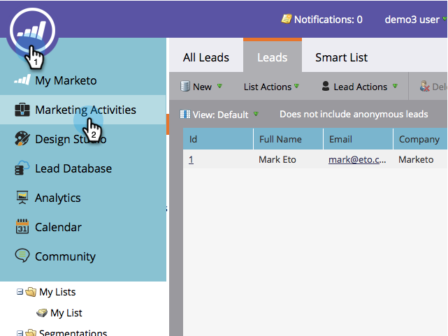

# Een mobiel pushbericht verzenden {#send-a-mobile-push-notification}

Stuur een pushmelding naar mensen die uw mobiele app gebruiken.

>[!PREREQUISITES]
>
>* [Nieuwe slimme campagne maken](/help/marketo/product-docs/core-marketo-concepts/smart-campaigns/creating-a-smart-campaign/create-a-new-smart-campaign.md)
>* [Een pushmelding maken](/help/marketo/product-docs/mobile-marketing/push-notifications/create-a-push-notification.md)

1. Ga naar de **Marketingactiviteiten** gebied.

   

1. Selecteer uw slimme campagne en klik op **Slimme lijst**.

   

1. Definieer uw slimme lijst en klik vervolgens op **Stroom**.

   

1. Selecteer een pushmelding. Klikken **Schema**.

   

   >[!NOTE]
   >
   >De pushmelding moet worden goedgekeurd voordat deze op de vervolgkeuzelijst wordt weergegeven.

1. Klikken **Eenmaal uitvoeren**.

   

1. Kies een datum en tijd. Klikken **Opslaan**.

   

Ga achterover en wacht tot uw pushmelding uitgaat.
