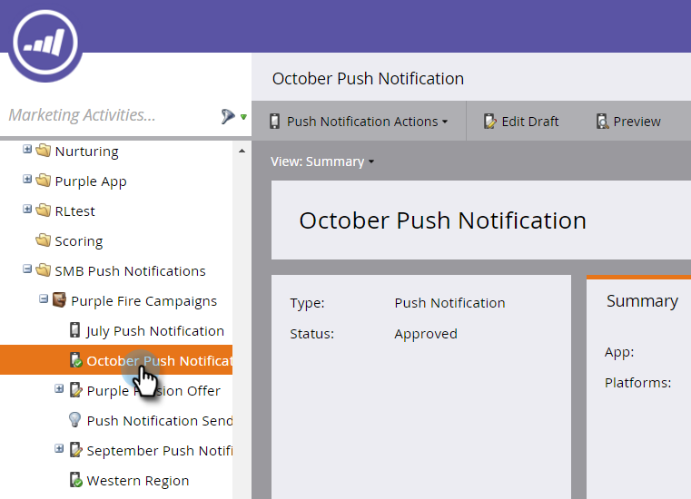

# Het dashboard voor pushmeldingen weergeven {#view-the-push-notification-dashboard}

Het is eenvoudig te zien hoe uw pushmeldingen werken.

1. Ga naar het **[!UICONTROL Marketing Activities]** -gebied.

   

1. Selecteer uw campagne.

   

1. Klik op **[!UICONTROL View: Summary]** en selecteer **[!UICONTROL Dashboard]** .

   

1. U kunt de [!UICONTROL Total Sent] en [!UICONTROL Total Taps] voor iOS en Android in cirkelgrafieken bekijken. Schuif omlaag om [!UICONTROL Tap Decay] te zien in staafgrafieken.

   

   >[!NOTE]
   >
   >_Verzonden_ metrisch kan meer wijzen verzendt dan het nauwkeurige aantal mensen aan wie het dupbericht werd verzonden. Dat is omdat het op het _aantal apparaten_ wordt berekend die om uw duw te ontvangen kwalificeren. Bijvoorbeeld, als één enkele persoon drie apparaten heeft, het dashboardregister drie verzendt, niet één.

   >[!MORELIKETHIS]
   >
   >* [&#x200B; Begrijpend de Berichten van de Duw &#x200B;](/help/marketo/product-docs/mobile-marketing/push-notifications/understanding-push-notifications.md)
   >* [&#x200B; verzend een Mobiel Push Bericht &#x200B;](/help/marketo/product-docs/mobile-marketing/push-notifications/send-a-mobile-push-notification.md)
