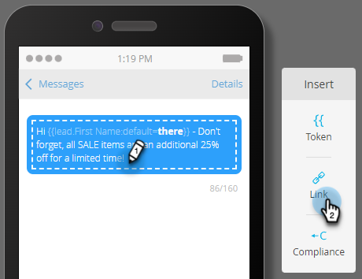

# Een SMS-bericht maken {#create-an-sms-message}

Hieronder wordt beschreven hoe u een SMS-bericht maakt.

>[!AVAILABILITY]
>
>Deze functie is beschikbaar als een invoegtoepassing voor uw Adobe Marketo Engage-account. Voor een correcte levering moet het via Adobe worden aangeschaft. Neem contact op met het Adobe-accountteam (uw accountmanager) voor meer informatie. De native integratie van Marketo Vibes SMS is beschikbaar in de VS en Canada. Voor andere landen, kan een verbinding via Webhooks van Marketo worden gebruikt door [ direct het contacteren van Lagen ](https://www.vibes.com/talk-to-sales).

>[!PREREQUISITES]
>
>[ voegt Levendigheden als Dienst LaunchPoint ](/help/marketo/product-docs/mobile-marketing/admin/add-vibes-as-a-launchpoint-service.md){target="_blank"} toe

1. Ga naar **[!UICONTROL Marketing Activities]** .

   

1. Klik met de rechtermuisknop op het gewenste programma en selecteer **[!UICONTROL New Local Asset]** .

   

1. Selecteer **Bericht van SMS**.

   

1. Ga een naam en een facultatieve beschrijving voor het nieuwe bericht van SMS in en klik **creeer**.

   

1. Klik in de editor in de blauwe ballon en voer tekst in.

   

   >[!NOTE]
   >
   >De tekenlimiet voor een SMS-bericht is 160 tekens volgens de standaard ASCII-tekenset. Als u meer dan 160 tekens gebruikt, wordt het bericht gesplitst op basis van het totale aantal tekens.

1. Om een teken in uw bericht toe te voegen, schrijf een snelle groet en klik **Symbolisch**.

   

   >[!NOTE]
   >
   >Als u een token toevoegt, kan het bericht de tekenlimiet overschrijden. Het bericht zou dan worden gesplitst, waardoor een extra bericht ontstaat.

   >[!IMPORTANT]
   >
   >SMS-compatibiliteit: alle uitgaande SMS-berichten moeten de merknaam of programmabeschrijving bevatten. HELP en STOP instructies zouden minstens eens per maand per abonnee voor terugkomende berichtprogramma&#39;s moeten worden verstrekt.

1. Selecteer het gewenste **Symbolische**, ga een facultatieve **StandaardWaarde** in, en klik **creeer**.

   

1. Om een verbinding toe te voegen, selecteer waar in het bericht u het wilt verschijnen en **Verbinding** klikken.

   

1. Selecteer een koppelingstype. Marketo Landing Page is de standaardinstelling. Als u hiermee werkt, klikt u op de vervolgkeuzelijst Openingspagina en selecteert u de gewenste pagina. Klik **Tussenvoegsel** wanneer gedaan.

   

   >[!NOTE]
   >
   >De twee koppelingen voor reeksspatiëring zijn standaard geselecteerd. Als u alleen Include mkt_tok uitschakelt, kan de koppeling nog wel worden bijgehouden, maar na omleiding bevat de doel-URL niet de parameter van de queryreeks mkt_tok. Deze parameter wordt gebruikt door Marketo Landing Pages en Munchkin om ervoor te zorgen dat de activiteiten van personen correct worden gevolgd (zoals wanneer een persoon uitgaat).

1. Als u externe URL in plaats daarvan wilt gebruiken, **Externe URL** selecteren, ga URL in/kleef, en klik **Tussenvoegsel**.

   

   >[!NOTE]
   >
   >Als &quot;Koppeling bijhouden&quot; ingeschakeld blijft, wijzigt Marketo automatisch de URL voor traceringsdoeleinden. Als u het bijhouden van wijzigingen uitschakelt, wordt de URL ongewijzigd in het bericht weergegeven (bijvoorbeeld `www.adobe.com` ).

   >[!CAUTION]
   >
   >Het wordt geadviseerd __ gebruik geen Kortere weg URL (b.v., Bitly), aangezien de dragers uw bericht als spam kunnen markeren.

1. De koppeling wordt weergegeven in het bericht.

   

   >[!NOTE]
   >
   >Marketo geeft een voorvertoning weer van de koppelingen naar het trackingdomein van de merken. Als u het selectievakje Markt_tok uitschakelt, wordt de koppeling gewijzigd.

Als u meer dan 160 tekens invoegt, wordt uw SMS in secties verbroken. Er geldt een algemeen maximum van 900 tekens per bericht. Als u dat overschrijdt, zal het bericht bij levering worden beknot.
