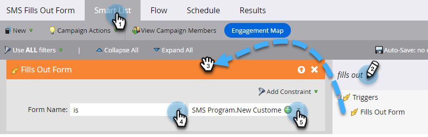
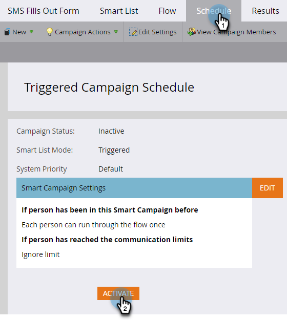

# Een SMS-bericht verzenden {#send-a-vibes-sms-message}

Je hebt [Je SMS-bericht maken](/help/marketo/product-docs/mobile-marketing/vibes-sms-messages/create-an-sms-message-2.md)Nu is het tijd om het te sturen. U kunt het verzenden via Campagne of Trigger.

>[!NOTE]
>
>Bij het verzenden van SMS-berichten:
>
>* Marketo Engage dedupliceert per telefoonnummer. Dus, als de veelvoudige mensen het zelfde telefoonaantal hebben, slechts zal één persoon het bericht ontvangen als zij een lid van slechts één lijst van het Abonnement van Vibes zijn. De-duping wordt gedaan op het niveau van de Abonnementenlijst van Vibes, niet het het programmaniveau van Marketo.
>* Marketo zal niet verzenden naar mensen die zijn gevoegd op lijst van gewenste personen of die het in de handel brengen hebben opgeschort.
>* Een SMS-bericht wordt niet naar iemand verzonden die niet is geabonneerd als deze niet in de lijst Mobiele database van Vibes staat.

## Een SMS-bericht over een batch verzenden {#send-a-batch-sms}

1. Klik in Mijn Marketo op **Marketingactiviteiten**.

   

1. Zoek en selecteer de gewenste slimme campagne.

   

1. Klik op de knop **Slimme lijst** en definieert u het publiek voor de SMS. In dit voorbeeld, verzenden wij naar iedereen in ons Gegevensbestand dat &quot;Adobe&quot;heeft die als hun bedrijf wordt vermeld.

   

1. In de **Stroom** tab, slepen over **SMS-bericht verzenden**. Selecteer de gewenste lijst van het Bericht van SMS en van Lagen van drop-down.

   

   >[!NOTE]
   >
   >De kiezer van de Lijst van Levendigheden fungeert als een verder filter voor het publiek dat al in de Slimme Lijst wordt geïdentificeerd om slechts mensen te richten die tot die lijst van Levenben behoren.

1. Klik op de knop **Schema** en plant uw SMS.

   

## SMS-en naar Trigger sturen {#send-a-trigger-sms}

1. Klik in Mijn Marketo op **Marketingactiviteiten**.

   

1. Zoek en selecteer de gewenste slimme campagne.

   

1. Klik op de knop **Slimme lijst** selecteert u de gewenste trigger en definieert u de waarde ervan. In dit voorbeeld gebruiken we **Formulier wordt ingevuld**.

   

1. In de **Stroom** tab, slepen over **SMS-bericht verzenden**. Selecteer de gewenste lijst van het Bericht van SMS en van Lagen van drop-down.

   

   >[!NOTE]
   >
   >De kiezer van de Lijst van Levendigheden fungeert als een verder filter voor het publiek dat al in de Slimme Lijst wordt geïdentificeerd om slechts mensen te richten die tot die lijst van Levenben behoren.

1. Klik op de knop **Schema** dan **Activeren**.

   

>[!MORELIKETHIS]
>
>* [Een bericht over een vibes maken](/help/marketo/product-docs/mobile-marketing/vibes-sms-messages/create-a-vibes-sms-message.md)
>* Stroomstappen van Vibes

