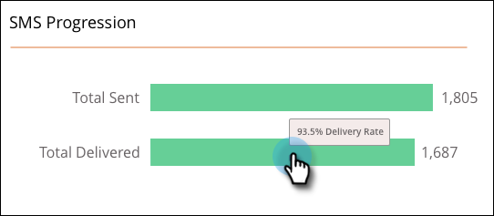

# Het SMS-berichtendashboard {#the-sms-message-dashboard}

Het dashboard voor SMS-berichten bevat nuttige informatie over uw SMS-bericht.

De **SMS-progressie** in de grafiek worden het totale aantal verzonden en het totale aantal geleverde grafieken weergegeven. De bedragen zijn bij het recht en als u over een bar beweegt, wordt het percentage getoond.

De **Samenvatting** in de grafiek wordt de berekende stuitsnelheid weergegeven als een percentage. Houd de muisaanwijzer boven de scheidingsbalk om de snelheid van de levering per hoeveelheid en percentage weer te geven. Houd de muisaanwijzer boven het oranje gedeelte Bounce Rate van de balk om de bedragen en percentages voor de waarde Zacht stuiteren en Hard stuitpercentage weer te geven.

De **Activiteit in de tijd** In de grafiek kunt u Totaal verzonden of Totaal geleverd selecteren. Selecteer een geschikt bereik in de datumbereikkiezer.

Duidelijk als bel!
