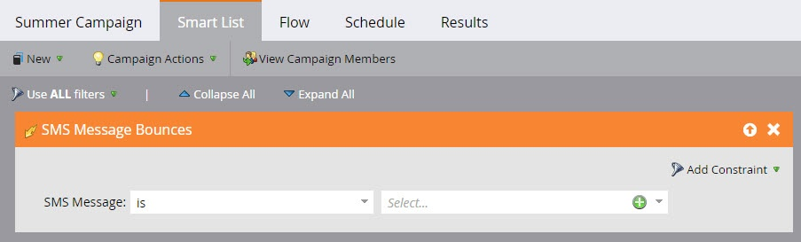
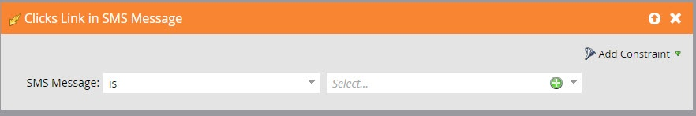

# SMS-berichten over Vibes gebruiken in Smart List-triggers en -filters {#use-vibes-sms-messages-in-smart-list-triggers-and-filters}

Na u [een SMS-bericht voor Vibes maken](/help/marketo/product-docs/mobile-marketing/vibes-sms-messages/create-a-vibes-sms-message.md), zult u slimme lijsttrekkers en filters binnen een slimme campagne willen gebruiken om de voordelen te krijgen. Zo gaat het.

1. Klik in Mijn Marketo op **Marketingactiviteiten**.

   

1. Kies een slimme campagne waarin u uw SMS-middel wilt gebruiken. Sleep over een trigger, zoals de populaire **Formulier wordt ingevuld**.

   

## SMS-triggers {#sms-triggers}

Er zijn andere SMS-triggers beschikbaar. De triggers van SMS worden alleen weergegeven als de service Vibes is ingeschakeld.

Hier volgen enkele voorbeelden:

Met de trigger voor SMS-berichtenbeloften wordt een stroom gestart, zoals het verzenden van een e-mail, wanneer een SMS-bericht beweegt.

De **Abonneren op lijst met beeldbestanden** trigger start een flow wanneer een persoon zich abonneert.

De **Klik op Koppeling in SMS-bericht** activeert een stroom wanneer een persoon op een verbinding in het bericht van SMS klikt.

## SMS-filters {#sms-filters}

U kunt ook Vibes-filters gebruiken in slimme lijsten. De **Geabonneerd op de Levendenlijst** filter zoekt iedereen die *ooit* geabonneerd op Vibes. Dit geldt zowel voor niet-geabonneerde als voor verwijderde personen, ook al worden verwijderde personen weggelaten uit de stroom. Dit filter is het meest geschikt voor rapportage.

De **Lid van de lijst van Vibes** filtervondsten _iedereen_ momenteel geabonneerd op Vibes en is het meest geschikt voor gebruik in slimme campagnes of lijsten.

>[!NOTE]
>
>Alle SMS-filters bevatten de **Datum van activiteit** beperking standaard.

Nadat u Vibes-triggers en -filters hebt ingesteld in uw slimme lijst, kunt u [de flow definiëren](/help/marketo/product-docs/mobile-marketing/vibes-sms-messages/add-a-flow-step-for-sms.md).

>[!MORELIKETHIS]
>
>* [Slimme lijst definiëren voor slimme campagne | Trigger](/help/marketo/product-docs/core-marketo-concepts/smart-campaigns/creating-a-smart-campaign/define-smart-list-for-smart-campaign-trigger.md)
>* [Filters zoeken en toevoegen aan een slimme lijst](/help/marketo/product-docs/core-marketo-concepts/smart-lists-and-static-lists/creating-a-smart-list/find-and-add-filters-to-a-smart-list.md)
