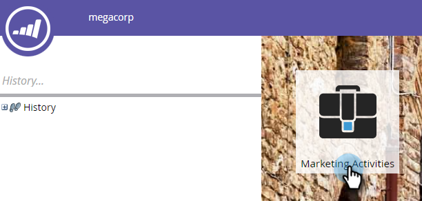

# SMS-berichten over Vibes gebruiken in Smart List-triggers en -filters {#use-vibes-sms-messages-in-smart-list-triggers-and-filters}

Nadat u een SMS-bericht [van Vibes hebt](create-a-vibes-sms-message.md)gemaakt, wilt u triggers en filters voor slimme lijsten gebruiken in een slimme campagne om de voordelen te benutten. Zo gaat het.

1. Klik in Mijn Marketo op **Marketingactiviteiten**.

   

1. Kies een slimme campagne waarin u uw SMS-middel wilt gebruiken. Sleep over een trigger, zoals het veelgebruikte formulier **** Vult uit.

   

## SMS-triggers {#sms-triggers}

Er zijn andere SMS-triggers beschikbaar. De triggers van SMS worden alleen weergegeven als de service Vibes is ingeschakeld.

Hier zijn een paar voorbeelden.

Met de trigger voor SMS-berichtenbeloften wordt een stroom gestart, zoals het verzenden van een e-mail, wanneer een SMS-bericht beweegt.

De trigger **Abonneren op lijst** met Vibes leidt een flow in wanneer een persoon zich abonneert.

De** klikt Verbinding in de trekker van SMS Bericht** initieert een stroom wanneer een persoon op een verbinding in het SMS bericht klikt.

## SMS-filters {#sms-filters}

U kunt ook Vibes-filters gebruiken in slimme lijsten. Met het filter **Geabonneerd op Lijst** met Vibes vindt u iedereen die zich *ooit* heeft geabonneerd op Vibes. Dit geldt zowel voor niet-geabonneerde als voor verwijderde personen, ook al worden verwijderde personen weggelaten uit de stroom. Dit filter is het meest geschikt voor rapportage.

Met het **filter** **Lid van lijst met virussen **vindt** u daarentegen **iedereen** ***die momenteel* op Vibes is geabonneerd en dat het meest geschikt is voor gebruik in slimme campagnes of lijsten.

>[!NOTE]
>
>Alle SMS-filters bevatten standaard de **beperking Datum van activiteit** .

Nadat u Vibes-triggers en -filters hebt ingesteld in uw slimme lijst, kunt u de flow definiëren.

>[!NOTE]
>
>**Verwante artikelen**
>
>* [Slimme lijst definiëren voor slimme campagne | Trigger](../../../product-docs/core-marketo-concepts/smart-campaigns/creating-a-smart-campaign/define-smart-list-for-smart-campaign-trigger.md)
>* [Filters zoeken en toevoegen aan een slimme lijst](../../../product-docs/core-marketo-concepts/smart-lists-and-static-lists/creating-a-smart-list/find-and-add-filters-to-a-smart-list.md)
>* [Voeg een Stap van de Stroom voor SMS toe](add-a-flow-step-for-sms.md)

>

