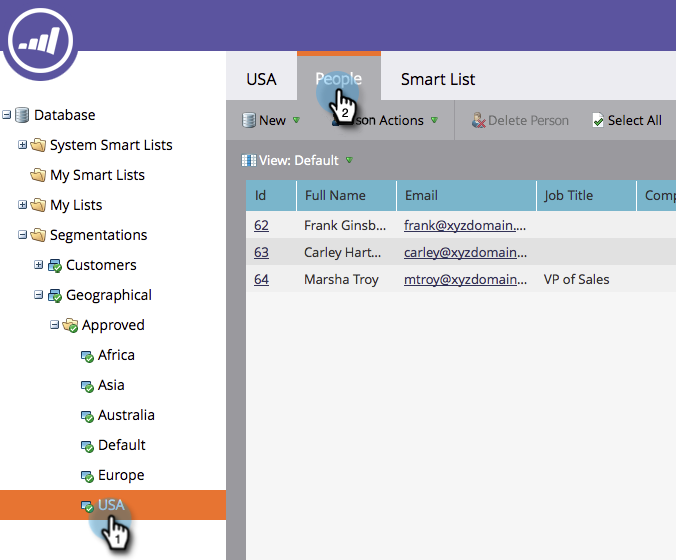

# Een segmentatie goedkeuren {#approve-a-segmentation}

Een segmentatie moet worden goedgekeurd voordat deze kan worden gebruikt.

>[!PREREQUISITES]
>
>* [ creeer een Segmentatie ](/help/marketo/product-docs/personalization/segmentation-and-snippets/segmentation/create-a-segmentation.md)
>* [ bepalen de Regels van het Segment ](/help/marketo/product-docs/personalization/segmentation-and-snippets/segmentation/define-segment-rules.md)

>[!NOTE]
>
>U kunt maximaal 20 segmenten tegelijk goedkeuren.

1. Ga naar de **[!UICONTROL Database]** .

   

1. Klik in de segmentatie op **[!UICONTROL Segmentation Actions]** en vervolgens op **[!UICONTROL Approve]** .

   

   >[!NOTE]
   >
   >De status verandert in [!UICONTROL Approving] met een draaiend wiel ( ) terwijl de goedkeuring bezig is.

   >[!CAUTION]
   >
   >De goedkeuring kan een paar minuten tot meer dan een dag duren, afhankelijk van de grootte van de database.

   Na goedkeuring verandert [!UICONTROL Status] van [!UICONTROL Approving] in [!UICONTROL Approved] .
   

   >[!TIP]
   >
   >Het aantal mensen in elk segment wordt getoond tussen haakjes naast de segmentnaam.

1. Het tabblad **[!UICONTROL People]** in **[!UICONTROL Segment]** geeft nu de definitieve lijst met personen voor het segment weer.

   

>[!CAUTION]
>
>Het totale aantal segmenten dat u in een segmentatie kunt maken, is afhankelijk van het aantal en het type filters dat wordt gebruikt en ook van de complexiteit van de logica van de segmenten. Hoewel u tot 100 segmenten kunt tot stand brengen gebruikend standaardgebieden, kan het gebruiken van andere types van filters de ingewikkeldheid verhogen, en uw segmentatie zou kunnen niet goedkeuren. Voorbeelden hiervan zijn: aangepaste velden, lijdenlijst, velden voor hoofdeigenaars en inkomstenstadia.
>
>Als u een foutenmelding tijdens goedkeuring krijgt en hulp in het verminderen van de ingewikkeldheid van uw segmentatie vereist, gelieve te contacteren {de Steun van 0} Marketo [.](https://nation.marketo.com/t5/Support/ct-p/Support)

>[!MORELIKETHIS]
>
>[ Filters van het Segment van het Gebruik in een Slimme Lijst ](/help/marketo/product-docs/personalization/segmentation-and-snippets/segmentation/use-segment-filters-in-a-smart-list.md)
