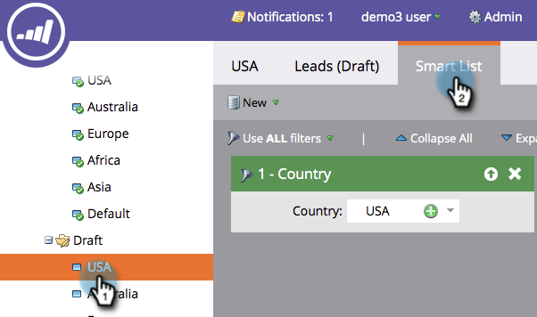

# Een segmentatie bewerken {#edit-a-segmentation}

Het is eenvoudig om wijzigingen aan te brengen in uw bestaande segmentaties. Hier is de onderkant.

## Een segmenteringsconcept maken {#create-a-segmentation-draft}

1. Ga naar de **[!UICONTROL Database]** .

   

1. Klik in de segmentatie op **[!UICONTROL Segmentation Actions]** en vervolgens op **[!UICONTROL Create Draft]** .

   

1. **[!UICONTROL Status]** verandert in [!UICONTROL Approved with Draft] . Er wordt een **[!UICONTROL Draft]** -map gemaakt in de segmentatie.

   

## Segmenten toevoegen, bewerken of verwijderen {#add-edit-or-delete-segments}

1. Klik in de segmentatie op **[!UICONTROL Segmentation Actions]** en vervolgens op **[!UICONTROL Edit Segments]** .

   

   >[!NOTE]
   >
   >U kunt alleen segmenten van een [!UICONTROL Draft] bewerken en niet de goedgekeurde segmentatie.

1. **[!UICONTROL Add Segment]** , **[!UICONTROL Edit]** bestaande segmenten (wijzig de naam van de segmenten of wijzig de volgorde) of **[!UICONTROL Delete]** alle segmenten.

   

   >[!NOTE]
   >
   >U moet een segment selecteren voordat u het kunt bewerken of verwijderen.

   >[!CAUTION]
   >
   >Het verwijderen beïnvloedt alle bijbehorende dynamische inhoud in e-mails, Landing Pages, en Fragmenten. **Er is geen ongedaan maken**. Controleer het tabblad **[!UICONTROL Used By]** om te zien wat dat segment gebruikt.

## Segmentregels bewerken {#edit-segment-rules}

1. In uw [!UICONTROL Draft] **Segment**, ga naar **[!UICONTROL Smart List]**. Pas regels toe gelijkend op [ het bepalen van de Regels van het Segment ](/help/marketo/product-docs/personalization/segmentation-and-snippets/segmentation/define-segment-rules.md).

   

   >[!NOTE]
   >
   >U kunt de goedgekeurde segmenten niet bewerken. Klik op Segmenten in de map [!UICONTROL Draft] om deze te bewerken.

   >[!NOTE]
   >
   >Vergeet niet uw segmentatieconcept goed te keuren.

U kunt experimenteren met segmentaties die niet worden gebruikt in dynamische inhoud.

>[!MORELIKETHIS]
>
>[ Schrap een Segmentatie ](/help/marketo/product-docs/personalization/segmentation-and-snippets/segmentation/delete-a-segmentation.md)
