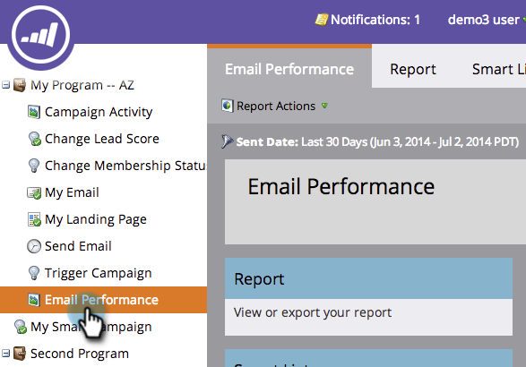
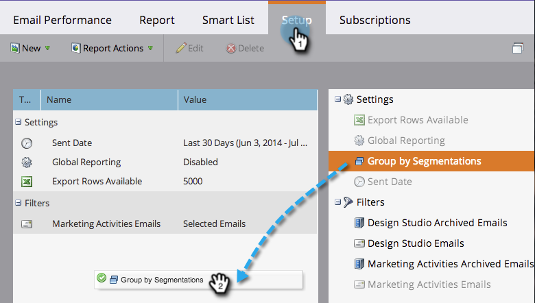

# E-mailrapporten groeperen per segment {#group-email-reports-by-segmentations}

Segmentaties gelden niet alleen voor dynamische inhoud. U kunt uw e-mailprestatierapport ook groeperen op segmentaties.

>[!PREREQUISITES]
>
>[ keur een Segmentatie ](/help/marketo/product-docs/personalization/segmentation-and-snippets/segmentation/approve-a-segmentation.md) goed

1. Ga naar het **[!UICONTROL Marketing Activities]** (of **[!UICONTROL Analytics]** ) gebied.

   

1. Selecteer uw **[!UICONTROL Email Performance]** -rapport.

   

1. Klik op de tab **[!UICONTROL Setup]** en sleep over **[!UICONTROL Group by Segmentations]** .

   

1. Kies een of twee segmentaties die u wilt gebruiken voor het groeperen van uw rapport. Klik op **[!UICONTROL Apply]**.

   

1. Dat is het! Klik op de tab **[!UICONTROL Report]** . Als u één segmentatie gebruikt, toont uw rapport één rij voor elk segment.

   

1. Als u twee segmentaties gebruikt, toont het één rij voor elke _combinatie_ van segmenten.

   

>[!MORELIKETHIS]
>
>[ filter Assets in een E-mailrapport ](/help/marketo/product-docs/reporting/basic-reporting/report-activity/filter-assets-in-an-email-report.md)
