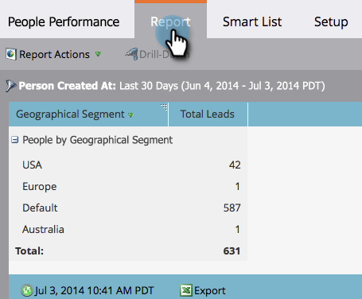

# Groepperingspersoonrapporten per segment {#group-person-reports-by-segment}

U kunt uw persoonrapporten groeperen door om het even welk segment dat u in uw segmentaties hebt bepaald.

1. Ga naar de sectie **[!UICONTROL Marketing Activities]** (of **[!UICONTROL Analytics]** ).

   

1. Selecteer uw persoonrapport in de navigatieboom.

   

1. Klik op de tab **[!UICONTROL Setup]** en dubbelklik **[!UICONTROL Group People by]** .

   

   >[!NOTE]
   >
   >U kunt ook [&#x200B; uw persoonrapporten door persoon of bedrijfattributen &#x200B;](/help/marketo/product-docs/reporting/basic-reporting/report-activity/group-person-reports-by-attribute.md) groeperen.

1. Typ &#39;Segmentatie&#39; in het tekstvak in het dialoogvenster **[!UICONTROL Group People by]** . Wanneer de **rubriek van Segmenten** verschijnt, selecteer van de lijst onder de rubriek.

   

1. Klik op de tab **[!UICONTROL Report]** om uw rapport te zien gegroepeerd op het geselecteerde segment.

   

>[!MORELIKETHIS]
>
>[&#x200B; voeg de Kolommen van de Douane aan een Rapport van de Persoon toe &#x200B;](/help/marketo/product-docs/reporting/basic-reporting/editing-reports/add-custom-columns-to-a-person-report.md)
