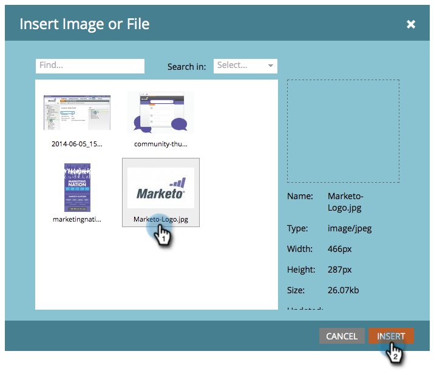

# Inhoud toevoegen aan een fragment {#add-content-to-a-snippet}

>[!PREREQUISITES]
>
>[ creeer een Fragment ](/help/marketo/product-docs/personalization/segmentation-and-snippets/snippets/create-a-snippet.md)

U kunt tokens, afbeeldingen, bestanden of tekst met opmaak toevoegen aan een fragment.

>[!NOTE]
>
>U kunt geen [ de e-mailsyntaxis van Marketo ](/help/marketo/product-docs/email-marketing/general/email-editor-2/email-template-syntax.md) in fragmenten inbedden; het zal **** niet in e-mail werken. Fragmenten moeten alleen body-inhoud zijn (HTML + TEXT).

1. Ga naar de **[!UICONTROL Design Studio]** .

   

1. Selecteer uw **Fragment** en klik **[!UICONTROL Edit Draft]**.

   

U kunt drie typen inhoud aan een fragment toevoegen.

## Toevoegen [!UICONTROL Token] {#add-token}

1. Sleep het element **[!UICONTROL Token]** .

   

1. Voer **[!UICONTROL Token]** in en klik op **[!UICONTROL Insert]** .

   

## Afbeelding/bestand toevoegen {#add-image-file}

1. Sleep het element **[!UICONTROL Image/File]** .

   

   >[!NOTE]
   >
   >U kunt uw eigen afbeeldingen of bestanden toevoegen aan Marketo. Leer meer over [ beelden en dossiers ](/help/marketo/product-docs/demand-generation/images-and-files/add-images-and-files-to-marketo.md).

1. Selecteer het **Beeld** te gebruiken en te klikken **[!UICONTROL Insert]**.

   

   >[!NOTE]
   >
   >U kunt ook naar een bepaalde afbeelding zoeken als u de naam van de afbeelding kent.

## Tekst toevoegen {#add-text}

1. Typ tekst in het gebied HTML-versie.

   

   >[!TIP]
   >
   >Gebruik de opmaakgereedschappen om de tekst aan te passen.

1. Klik voor E-mailberichten op het tabblad **[!UICONTROL Text Version (for emails)]** .

   

1. Klik op **[!UICONTROL Copy from HTML]**.

   

   >[!NOTE]
   >
   >Afbeeldingen, koppelingen en opmaak worden verwijderd uit de tekstversie.

Koel! Nu kunt u diverse soorten inhoud voor uw fragment maken.

>[!MORELIKETHIS]
>
>* [ Voorproef een Fragment ](/help/marketo/product-docs/personalization/segmentation-and-snippets/snippets/preview-a-snippet.md)
>* [ keur een Fragment ](/help/marketo/product-docs/personalization/segmentation-and-snippets/snippets/approve-a-snippet.md) goed
