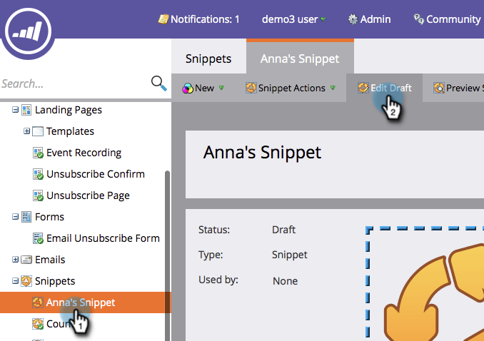

# Inhoud toevoegen aan een fragment {#add-content-to-a-snippet}

>[!PREREQUISITES]
>
>[Een fragment maken](/help/marketo/product-docs/personalization/segmentation-and-snippets/snippets/create-a-snippet.md)

U kunt tokens, afbeeldingen, bestanden of tekst met opmaak toevoegen aan een fragment.

>[!NOTE]
>
>U kunt geen [Marketo-e-mailsyntaxis](/help/marketo/product-docs/email-marketing/general/email-editor-2/email-template-syntax.md) in fragmenten insluiten. het zal **niet** in een e-mail werken. Fragmenten moeten alleen body-inhoud zijn (HTML + TEXT).

1. Ga naar **Design Studio**.

   

1. Selecteer uw **Fragment** en klik **Concept** bewerken.

   

U kunt drie typen inhoud aan een fragment toevoegen.

## Token {#add-token} toevoegen

1. Sleep het element **Token**.

   

1. Typ **Token** en klik op **Invoegen**.

   

## Afbeelding/bestand {#add-image-file} toevoegen

1. Sleep het **Image/File**-element.

   

   >[!NOTE]
   >
   >U kunt uw eigen afbeeldingen of bestanden toevoegen aan Marketo. Meer informatie over [afbeeldingen en bestanden](/help/marketo/product-docs/demand-generation/images-and-files/add-images-and-files-to-marketo.md).

1. Selecteer **Afbeelding** die u wilt gebruiken en klik op **Invoegen**.

   

   >[!NOTE]
   >
   >U kunt ook naar een bepaalde afbeelding zoeken als u de naam van de afbeelding kent.

## Tekst {#add-text} toevoegen

1. Typ tekst in het gebied HTML-versie.

   

   >[!TIP]
   >
   >Gebruik de opmaakgereedschappen om de tekst aan te passen.

1. Voor E-mail, klik **de Versie van de Tekst** tabel.

   

1. Klik **Kopiëren van HTML**.

   

   >[!NOTE]
   >
   >Afbeeldingen, koppelingen en opmaak worden verwijderd uit de tekstversie.

Koel! Nu kunt u diverse soorten inhoud voor uw fragment maken.

>[!MORELIKETHIS]
>
>* [Een voorvertoning van een fragment weergeven](/help/marketo/product-docs/personalization/segmentation-and-snippets/snippets/preview-a-snippet.md)
>* [Een fragment goedkeuren](/help/marketo/product-docs/personalization/segmentation-and-snippets/snippets/approve-a-snippet.md)

