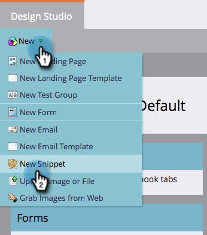

# Een fragment maken {#create-a-snippet}

Fragmenten kunnen worden gebruikt als dynamische inhoudsblokken op **e-mail** en **landingspagina&#39;s**.

1. Ga naar de **Design Studio.**

   

1. Klikken **Nieuw** en vervolgens **Nieuw fragment**.

   

1. Voer de vereiste gegevens in en klik op **Maken**.

   

Goed werk! Vereenvoudig uw werk door fragmenten voor dynamische inhoud te maken. Nu kun je doorgaan en [inhoud toevoegen aan uw nieuwe fragment](/help/marketo/product-docs/personalization/segmentation-and-snippets/snippets/add-content-to-a-snippet.md).

>[!MORELIKETHIS]
>
>* [Inhoud toevoegen aan een fragment](/help/marketo/product-docs/personalization/segmentation-and-snippets/snippets/add-content-to-a-snippet.md)
>* [Dynamische inhoud](/help/marketo/product-docs/personalization/segmentation-and-snippets/segmentation/understanding-dynamic-content.md)

