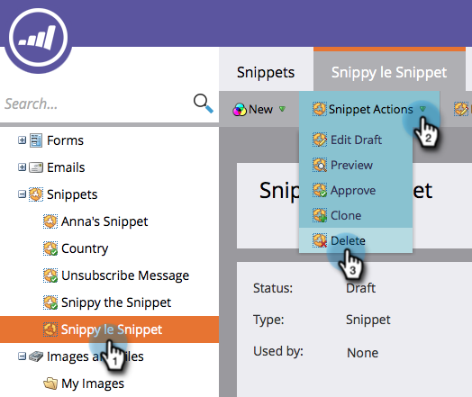

# Een fragment verwijderen {#delete-a-snippet}

>[!PREREQUISITES]
>
>[ keurt een Fragment ](/help/marketo/product-docs/personalization/segmentation-and-snippets/snippets/unapprove-a-snippet.md) niet goed

Verwijder een fragment dat u niet meer nodig hebt.

1. Ga naar de **[!UICONTROL Design Studio]** .

   

1. Ga naar uw fragment en klik vervolgens onder **[!UICONTROL Snippet Actions]** op **[!UICONTROL Delete]** .

   

1. Klik op **[!UICONTROL Delete]** om te bevestigen of alleen op **[!UICONTROL Cancel]** .

   

   >[!NOTE]
   >
   >U kunt alleen een fragment verwijderen dat niet is goedgekeurd en niet wordt gebruikt door elementen.

Gereed! U kunt het niet terugwinnen, zodat zeker ben alvorens u de schrappingsknoop klikt.
