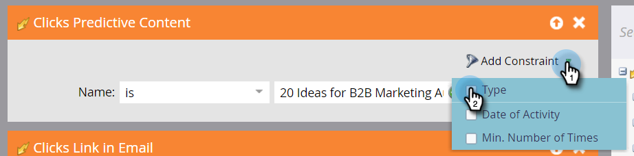
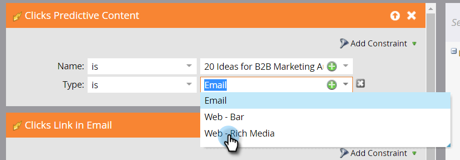

# Een slimme lijst definiëren voor activiteiten met betrekking tot voorspellende inhoud {#define-a-smart-list-for-predictive-content-activities}

U kunt activiteiten met voorspellende inhoud gebruiken in triggers en filters wanneer u een slimme lijst definieert in een slimme campagne. U kunt een actie voor iedereen teweegbrengen die voorspelbare inhoud via het [ Rijke malplaatje van Media ](/help/marketo/product-docs/predictive-content/enabling-predictive-content/enable-predictive-content-for-web-rich-media.md) klikt, de [ Bar van de Aanbeveling van de Inhoud ](/help/marketo/product-docs/predictive-content/enabling-predictive-content/enable-the-content-recommendation-bar.md), of in een [ e-mail ](/help/marketo/product-docs/predictive-content/enabling-predictive-content/enable-predictive-content-in-emails.md).

1. Navigeer in uw slimme campagne naar het tabblad **[!UICONTROL Smart List]** .

   

   >[!NOTE]
   >
   >Slimme lijsten kunnen verbazingwekkende dingen doen. Leer meer in de [ slimme lijst diep duiken ](/help/marketo/product-docs/core-marketo-concepts/smart-campaigns/understanding-smart-campaigns.md).

1. Zoek de trigger en sleep deze naar het canvas.

   

   >[!NOTE]
   >
   >Een slimme campagne met triggers wordt uitgevoerd in de triggermodus. De functie wordt op één persoon tegelijk uitgevoerd op basis van gebeurtenissen die worden geactiveerd en de filters worden toegevoegd.

1. Klik op de vervolgkeuzelijst **[!UICONTROL Name]** en selecteer een operator.

   

1. Geef de trigger op.

   

1. Voeg de restrictie **[!UICONTROL Type]** toe.

   

1. Selecteer de bron die u nodig hebt voor uw slimme lijst.

   

1. Als u de e-mailbron voor uw voorspellende inhoud gebruikt, voegt u de trigger **[!UICONTROL Clicks Link in Email]** toe. Selecteer het e-mailadres en voeg de restrictie **[!UICONTROL Is Predictive]** toe, gedefinieerd als **[!UICONTROL true]** .

   

1. Voeg desgewenst andere filters toe.

   

   >[!TIP]
   >
   >In een slimme campagne met zowel triggers als filters gaan de triggers bovenaan. Wanneer geactiveerd, gaan alleen mensen die aan de filtercriteria voldoen door de flow.

   >[!NOTE]
   >
   >Bij meerdere triggers gaat een persoon door naar de flow als een van de triggers wordt geactiveerd.

   Om de campagne op een reeks mensen allen tezelfdertijd in werking te stellen, leer hoe te [ een slimme lijst voor een partij slimme campagne ](/help/marketo/product-docs/core-marketo-concepts/smart-campaigns/creating-a-smart-campaign/define-smart-list-for-smart-campaign-batch.md) bepalen.

   >[!MORELIKETHIS]
   >
   >* [ bepaalt Slimme Lijst voor Slimme Campagne | Batch ](/help/marketo/product-docs/core-marketo-concepts/smart-campaigns/creating-a-smart-campaign/define-smart-list-for-smart-campaign-batch.md)
   >* [ voeg een Stap van de Stroom aan een Slimme Campagne toe ](/help/marketo/product-docs/core-marketo-concepts/smart-campaigns/flow-actions/add-a-flow-step-to-a-smart-campaign.md)
   >* [ bepaal een Slimme Lijst voor de Activiteiten van Personalization van het Web ](/help/marketo/product-docs/web-personalization/working-with-web-campaigns/define-a-smart-list-for-web-personalization-activities.md)
   >* [ laat Voorspelende Inhoud voor Web Rich Media ](/help/marketo/product-docs/predictive-content/enabling-predictive-content/enable-predictive-content-for-web-rich-media.md) toe
   >* [ laat de Bar van de Aanbeveling van de Inhoud ](/help/marketo/product-docs/predictive-content/enabling-predictive-content/enable-the-content-recommendation-bar.md) toe
