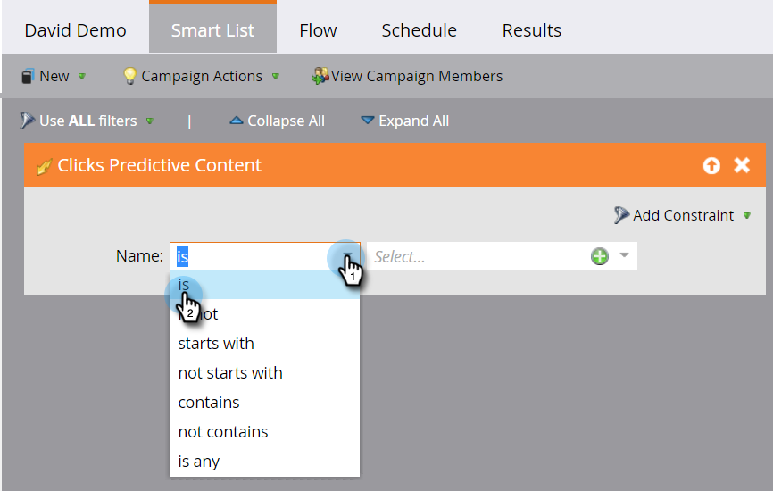

# Een slimme lijst definiëren voor activiteiten met voorspellende inhoud {#define-a-smart-list-for-predictive-content-activities}

U kunt activiteiten met voorspellende inhoud gebruiken in triggers en filters wanneer u een slimme lijst definieert in een slimme campagne. U kunt een actie voor iedereen teweegbrengen die voorspelbare inhoud via [Rich Media malplaatje](/help/marketo/product-docs/predictive-content/enabling-predictive-content/enable-predictive-content-for-web-rich-media.md), [de Bar van de Aanbeveling van de Inhoud ](/help/marketo/product-docs/predictive-content/enabling-predictive-content/enable-the-content-recommendation-bar.md), of in [email](/help/marketo/product-docs/predictive-content/enabling-predictive-content/enable-predictive-content-in-emails.md) klikt.

1. Navigeer in uw slimme campagne naar het tabblad **Slimme lijst**.

   

   >[!NOTE]
   >
   >Slimme lijsten kunnen verbazingwekkende dingen doen. Leer meer in [slimme lijst diep duik](/help/marketo/product-docs/core-marketo-concepts/smart-campaigns/understanding-smart-campaigns.md).

1. Zoek de trigger en sleep deze naar het canvas.

   

   >[!NOTE]
   >
   >Een slimme campagne met triggers wordt uitgevoerd in de triggermodus. De functie wordt op één persoon tegelijk uitgevoerd op basis van gebeurtenissen die worden geactiveerd en de filters worden toegevoegd.

1. Klik op de vervolgkeuzelijst **Naam** en selecteer een operator.

   

1. Definieer de trigger.

   

1. Voeg de beperking **Type** toe.

   

1. Selecteer de bron die u nodig hebt voor uw slimme lijst.

   

1. Als u de e-mailbron voor uw vooruitlopende inhoud gebruikt, voegt u de **Klik op Koppeling in de trigger E-mail** toe. Selecteer uw e-mail en voeg de **Is Predictive** beperking toe, die als **true** wordt bepaald.

   

1. Voeg desgewenst andere filters toe.

   

   >[!TIP]
   >
   >In een slimme campagne met zowel triggers als filters gaan de triggers bovenaan. Wanneer geactiveerd, gaan alleen mensen die aan de filtercriteria voldoen door de flow.

   >[!NOTE]
   >
   >Bij meerdere triggers gaat een persoon door naar de flow als een van de triggers wordt geactiveerd.

   Om de campagne op een reeks mensen tezelfdertijd in werking te stellen, leer hoe te [een slimme lijst voor een partij slimme campagne ](/help/marketo/product-docs/core-marketo-concepts/smart-campaigns/creating-a-smart-campaign/define-smart-list-for-smart-campaign-batch.md) bepalen.

   >[!MORELIKETHIS]
   >
   >* [Slimme lijst definiëren voor slimme campagne | Batch](/help/marketo/product-docs/core-marketo-concepts/smart-campaigns/creating-a-smart-campaign/define-smart-list-for-smart-campaign-batch.md)
   >* [Een stroomstap toevoegen aan een slimme campagne](/help/marketo/product-docs/core-marketo-concepts/smart-campaigns/flow-actions/add-a-flow-step-to-a-smart-campaign.md)
   >* [Een slimme lijst definiëren voor activiteiten van webpersonalisatie](/help/marketo/product-docs/web-personalization/working-with-web-campaigns/define-a-smart-list-for-web-personalization-activities.md)
   >* [Voorspelende inhoud voor web-rijke media inschakelen](/help/marketo/product-docs/predictive-content/enabling-predictive-content/enable-predictive-content-for-web-rich-media.md)
   >* [De balk met aanbevelingen voor inhoud inschakelen](/help/marketo/product-docs/predictive-content/enabling-predictive-content/enable-the-content-recommendation-bar.md)

